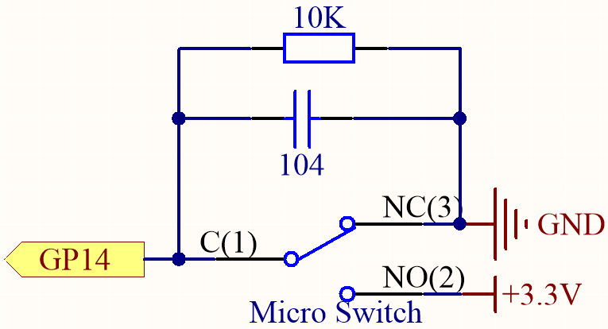
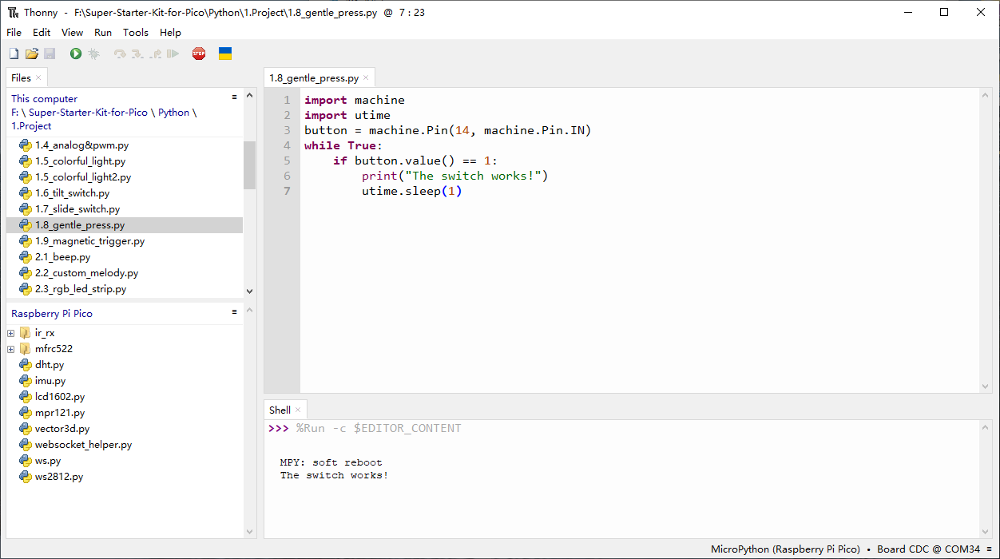
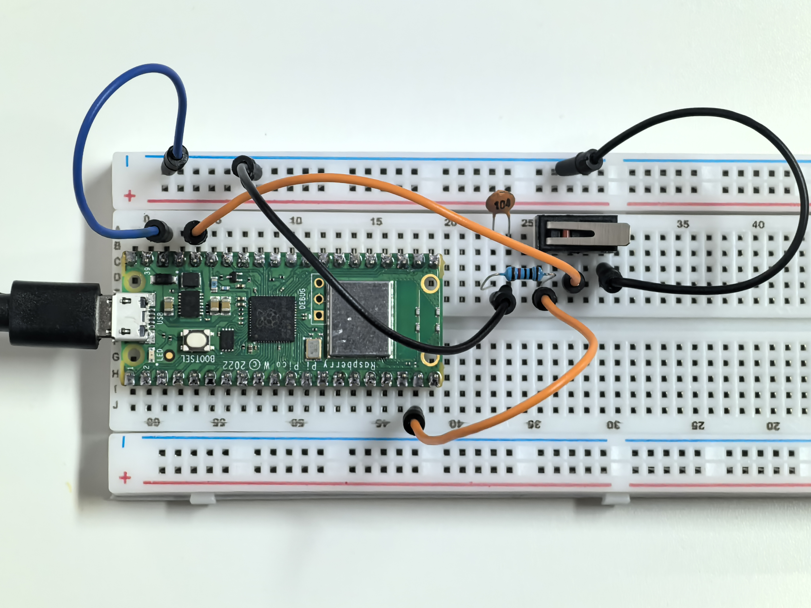

1.8 Gentle Press
===================
A micro switch is a 3-pin device, with the pins labeled as C (common), NO (normally open), 
and NC (normally closed). When the switch is not pressed, the common pin (C) is connected to 
the normally closed pin (NC). When the switch is pressed, the common pin (C) connects to the 
normally open pin (NO) instead.

Component List
^^^^^^^^^^^^^^^
- Raspberry Pi Pico W x1
- MicroUSB cable x1
- 830 Tie-Points Breadboard x1
- Jumper Wire Several
- Resistor 10KΩx1
- Capacitor 104 x1
- Micro Switch x1

Component knowledge
^^^^^^^^^^^^^^^^^^^^
:ref:`Micro Switch <cpn_micro_switch>`
"""""""""""""""""""""""""""""""""""""""""

Schematic
^^^^^^^^^^

By default, GP14 is in a low state. When the micro switch is pressed, GP14 goes high.

The 10K resistor ensures that GP14 remains low when the switch is not pressed, 
providing a stable low state.

Additionally, the 104 ceramic capacitor is used to filter out any electrical noise 
or jitter that might occur during switching.

Connect
^^^^^^^^^
.. image:: img/3.connect/1.8.png

Code
^^^^^^^
.. note::

    * Open the ``1.8_gentle_press.py`` file under the path of ``Ultimate-Starter-Kit-for-Pico\Python\1.Project`` or copy this code into Thonny, then click "Run Current Script" or simply press F5 to run it.

    * Don't forget to click on the "MicroPython (Raspberry Pi Pico)" interpreter in the bottom right corner. 

After the program runs, when you toggle the slide switch to the right, “The swit
ch works!” will appear in the shell.

The following is the program code:

.. code-block:: python

    import machine
    import utime
    button = machine.Pin(14, machine.Pin.IN)
    while True:
        if button.value() == 1:
            print("The switch works!")
            utime.sleep(1)

Phenomenon
^^^^^^^^^^^
