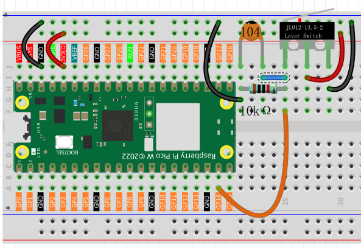

1.8 Gentle Press
===================
Micro Switch is also a 3-pin device, the sequence of the 3 pins are C (common pin), 
NO (normally open) and NC (normally closed) .

When the micro switch is not pressed, 1 (C) and 3 (NC) are connected together, 
when pressed 1 (C) and 2 (NO) are connected together.

Component List
^^^^^^^^^^^^^^^
- Raspberry Pi Pico W x1
- MicroUSB cable x1
- 830 Tie-Points Breadboard x1
- Jumper Wire Several
- Resistor 10KΩx1
- Capacitor 104 x1
- Micro Switch x1

Component knowledge
^^^^^^^^^^^^^^^^^^^^
:ref:`RGB-LED <cpn_rgb_led>`
"""""""""""""""""""""""""""""""

Schematic
^^^^^^^^^^

By default, GP14 is low and when pressed, GP14 is high.

The purpose of the 10K resistor is to keep the GP14 low during pressing.

The 104 ceramic capacitor is used here to eliminate jitter.

Connect
^^^^^^^^^

Code
^^^^^^^
.. note::

    * Open the ``1.8_gentle_press.py`` file under the path of ``Ultimate-Starter-Kit-for-Pico\Python\1.Project`` or copy this code into Thonny, then click "Run Current Script" or simply press F5 to run it.

    * Don't forget to click on the "MicroPython (Raspberry Pi Pico)" interpreter in the bottom right corner. 

.. image:: img/4.software/1.8.png

After the program runs, when you toggle the slide switch to the right, “The swit
ch works!” will appear in the shell.

The following is the program code:

.. code-block:: python

    import machine
    import utime
    button = machine.Pin(14, machine.Pin.IN)
    while True:
        if button.value() == 1:
            print("The switch works!")
            utime.sleep(1)

Phenomenon
^^^^^^^^^^^
