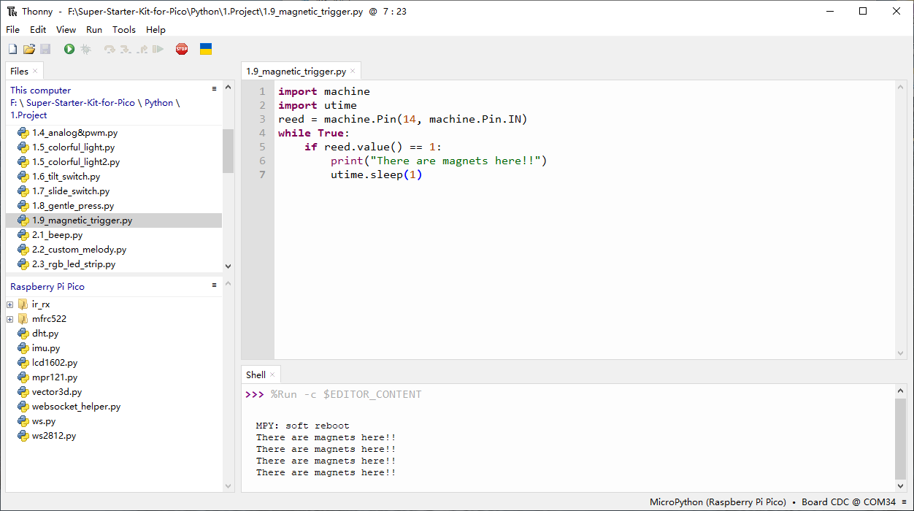
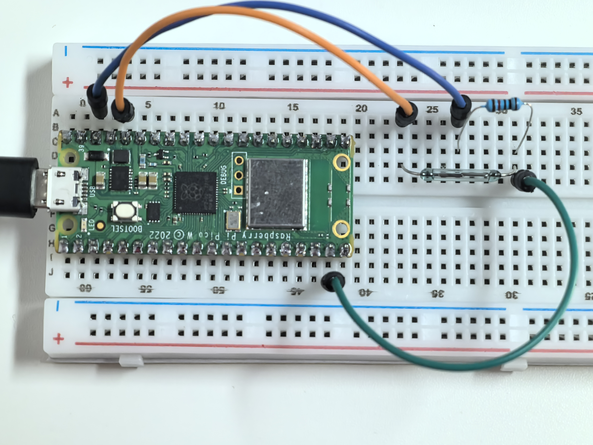

1.9 Magnetic Trigger
=========================
The typical reed switch consists of two flexible metal reeds that can be magnetized. 
These reeds are normally separated by a small gap at their ends when the switch is open. 
When a magnetic field (from either an electromagnet or a permanent magnet) is applied, the 
reeds are attracted to each other, closing the electrical circuit. Once the magnetic field 
is removed, the spring-like nature of the reeds causes them to separate again, reopening the circuit.

A common use of reed switches is in security systems to detect when doors or windows are opened.

Component List
^^^^^^^^^^^^^^^
- Raspberry Pi Pico W x1
- MicroUSB cable x1
- 830 Tie-Points Breadboard x1
- Jumper Wire Several
- Resistor 10KΩ x1
- Reed Switch x1

Component knowledge
^^^^^^^^^^^^^^^^^^^^
:ref:`Reed Switch <cpn_reed_switch>`
""""""""""""""""""""""""""""""""""""""""

Schematic
^^^^^^^^^^
.. image:: img/2.sch/1.9.png
    
GP14 is normally low and will switch to a high state when a magnet is brought close to the reed switch.

The 10K resistor helps maintain a stable low level on GP14 when no magnet is present, ensuring reliable operation.

Connect
^^^^^^^^^

Code
^^^^^^^
.. note::

    * Open the ``1.9_magnetic_trigger.py`` file under the path of ``Ultimate-Starter-Kit-for-Pico\Python\1.Project`` or copy this code into Thonny, then click "Run Current Script" or simply press F5 to run it.

    * Don't forget to click on the "MicroPython (Raspberry Pi Pico)" interpreter in the bottom right corner. 

Click “Run current script”, GP14 goes high when a magnet is near the reed switch, other
wise it goes low.

The following is the program code:

.. code-block:: python

    import machine
    import utime
    reed = machine.Pin(14, machine.Pin.IN)
    while True:
        if reed.value() == 1:
            print("There are magnets here!!")
            utime.sleep(1)

Phenomenon
^^^^^^^^^^^

    

