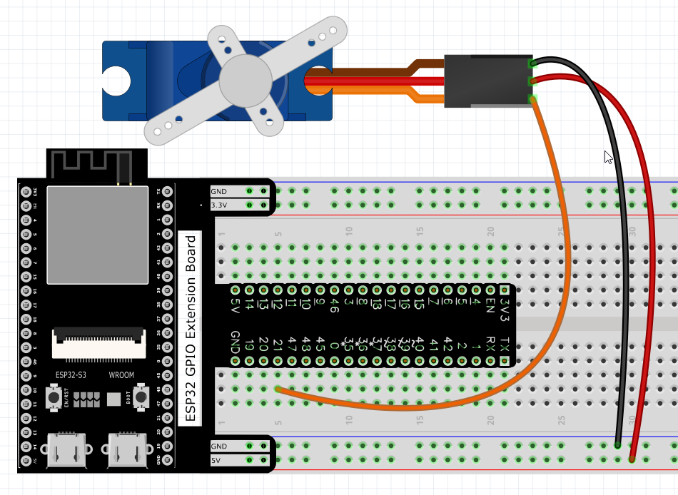
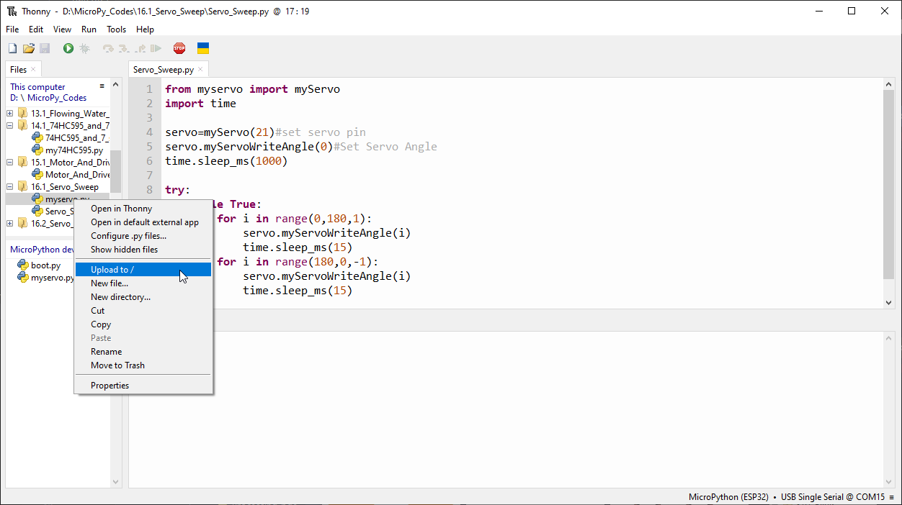
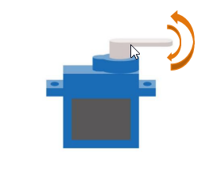
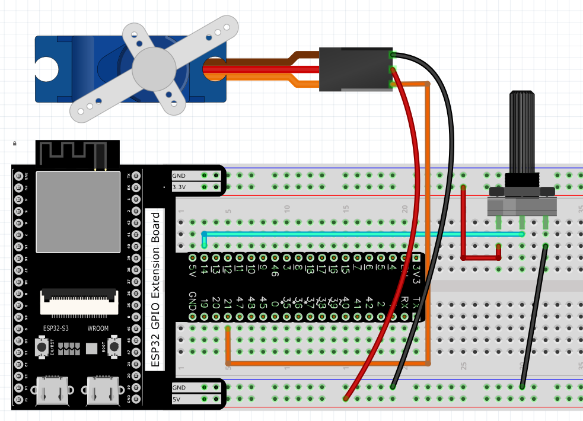
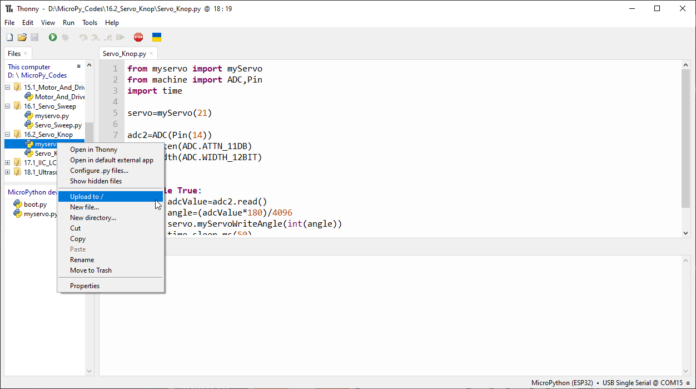

Chapter 16 Servo 
=========================
Previously, we learned how to control the speed and rotational direction of a mo
tor. In this chapter, we will learn about servos which are a rotary actuator ty
pe motor that can be controlled to rotate to specific angles.

Project 16.1 Servo Sweep
------------------------
First, we need to learn how to make a servo rotate.

Component List
^^^^^^^^^^^^^^^
- ESP32-S3-WROOM x1
- GPIO Extension Board x1
- 830 Tie-Points Breadboard x1
- Servo x1
- Jumper Wire x5

Connect
^^^^^^^^^
Use caution when supplying power to the servo, it should be 5V. Make sure you do 
not make any errors when connecting the servo to the power supply.

Code
^^^^^^^
Move the program folder “Super_Starter_Kit_for_ESP32_S3/Python/Python_C
odes” to disk(D) in advance with the path of “D:/Micropython_Codes”.

Open “Thonny”, click “This computer” >> “D:” >> “Micropython_Codes” >> “16.1_Servo_S
weep”. Select “myservo.py”, right click your mouse to select “Upload to /”, wait 
for “myservo.py” to be uploaded to ESP32-S3 and then double click “Servo_Sweep.py”.

**16.1_Servo_Sweep**

Click “Run current script”, the Servo will rotate from 0 degrees to 180 degrees 
and then reverse the direction to make it rotate from 180 degrees to 0 degrees 
and repeat these actions in an endless loop.

Code
^^^^^^
The following is the program code:

.. code-block:: python
    
    from myservo import myServo
    import time

    servo=myServo(21)#set servo pin
    servo.myServoWriteAngle(0)#Set Servo Angle
    time.sleep_ms(1000)

    try:
        while True:       
            for i in range(0,180,1):
                servo.myServoWriteAngle(i)
                time.sleep_ms(15)
            for i in range(180,0,-1):
                servo.myServoWriteAngle(i)
                time.sleep_ms(15)        
    except:
        servo.deinit()

Project 16.2 Servo Knop
------------------------
Use a potentiometer to control the servo motor to rotate at any angle.

Component List
^^^^^^^^^^^^^^^
- ESP32-S3-WROOM x1
- GPIO Extension Board x1
- 830 Tie-Points Breadboard x1
- Servo x1
- Potentiometer(10k) x1
- Jumper Wire x6

Connect
^^^^^^^
Use caution when supplying power to the servo, it should be 5V. Make sure you do 
not make any errors when connecting the servo to the power supply.

Code
^^^^^^^
Move the program folder “Super_Starter_Kit_for_ESP32_S3/Python/Python_C
odes” to disk(D) in advance with the path of “D:/Micropython_Codes”.

Open “Thonny”, click “This computer” >> “D:” >> “Micropython_Codes” >> “16.2_Servo_K
nop”. Select “myservo.py”, right click your mouse to select “Upload to /”, wait 
for “myservo.py” to be uploaded to ESP32S3 and then double click “Servo_Knop.py”.

**16.2_Servo_Knop**

Click “Run current script”, twist the potentiometer back and forth, and the servo 
motor rotates accordingly.

.. image:: img/phenomenon/16.2.png

Code
^^^^^^
The following is the program code:

.. code-block:: python

    from myservo import myServo
    from machine import ADC,Pin
    import time

    servo=myServo(21)

    adc2=ADC(Pin(14))
    adc2.atten(ADC.ATTN_11DB)
    adc2.width(ADC.WIDTH_12BIT)

    try:
        while True:
            adcValue=adc2.read()
            angle=(adcValue*180)/4096
            servo.myServoWriteAngle(int(angle))
            time.sleep_ms(50)
    except:
        servo.deinit()

In this project, we will use Pin(14) of ESP32-S3 to read the ADC value of the 
rotary potentiometer and then convert it to the angle value required by the 
servo and control the servo to rotate to the corresponding angle.