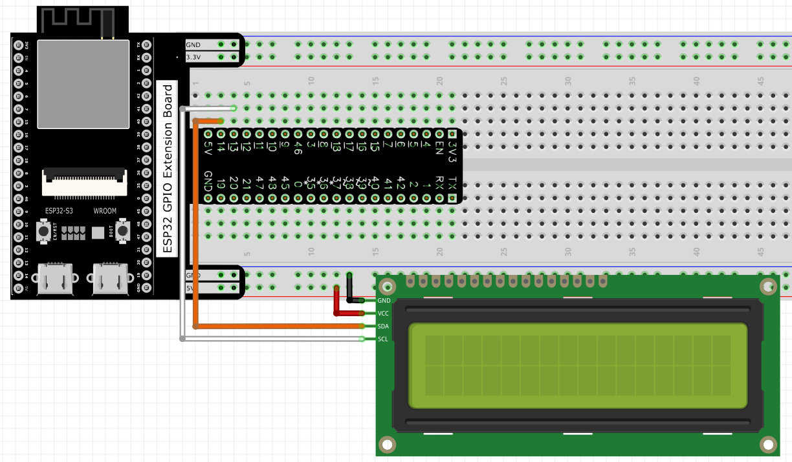
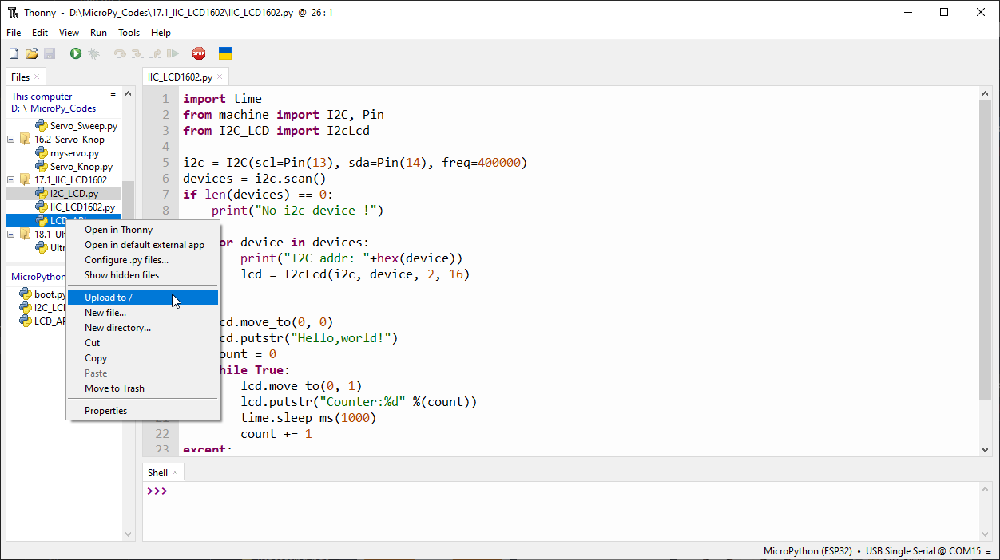
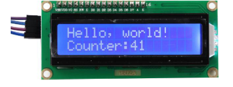

Chapter 17 LCD1602
=========================
In this chapter, we will learn about the LCD1602 Display Screen

Project 17.1 LCD1602
-----------------------
In this section we learn how to use LCD1602 to display something.

Component List
^^^^^^^^^^^^^^^
- ESP32-S3-WROOM x1
- GPIO Extension Board x1
- 830 Tie-Points Breadboard x1
- LCD1602 IIC x1
- F-M DuPont Cable x4

Connect
^^^^^^^^^^^^

Code
^^^^^^^
Move the program folder “Super_Starter_Kit_for_ESP32_S3/Python/Python_C
odes” to disk(D) in advance with the path of “D:/Micropython_Codes”.

Open “Thonny”, click “This computer” >> “D:” >> “Micropython_Codes” >> “17.1_I2C_LCD1602”. 
Select “I2C_LCD.py”and “LCD_API.py”, right click your mouse to select “Upload to 
/”, wait for “I2C_LCD.py” and “LCD_API.py” to be uploaded to ESP32-S3 and then 
double click “I2C_LCD1602.py”.

**17.1_I2C_LCD1602**

Click “Run current script” and LCD1602 displays some characters.

The following is the program code:

.. code-block:: python

    import time
    from machine import I2C, Pin
    from I2C_LCD import I2cLcd

    i2c = I2C(scl=Pin(13), sda=Pin(14), freq=400000)
    devices = i2c.scan()
    if len(devices) == 0:
        print("No i2c device !")
    else:
        for device in devices:
            print("I2C addr: "+hex(device))
            lcd = I2cLcd(i2c, device, 2, 16)

    try:
        lcd.move_to(0, 0)
        lcd.putstr("Hello,world!")
        count = 0
        while True:
            lcd.move_to(0, 1)
            lcd.putstr("Counter:%d" %(count))
            time.sleep_ms(1000)
            count += 1
    except:
        pass

