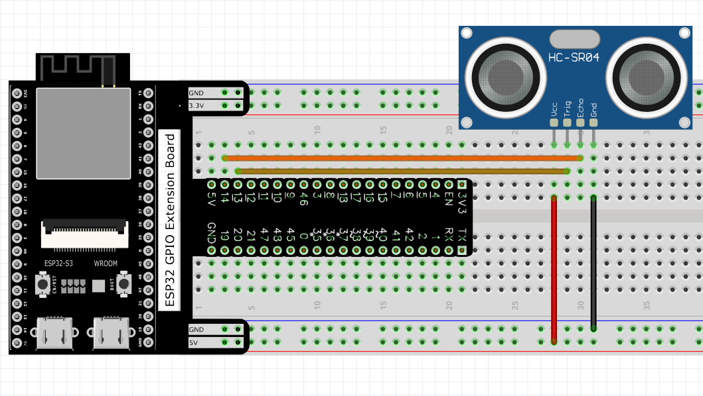
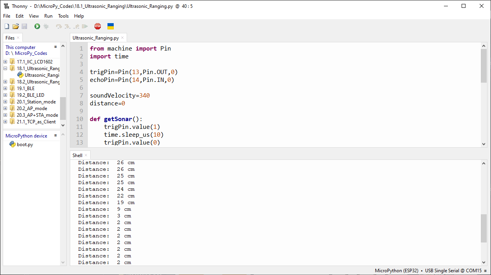
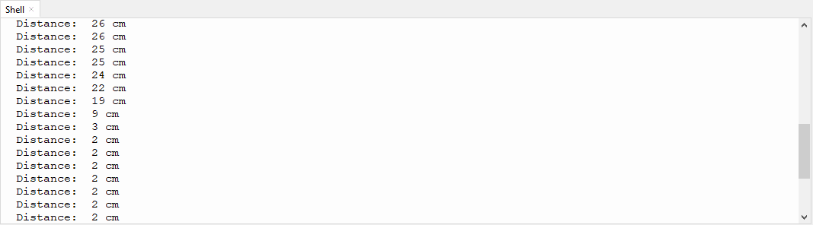
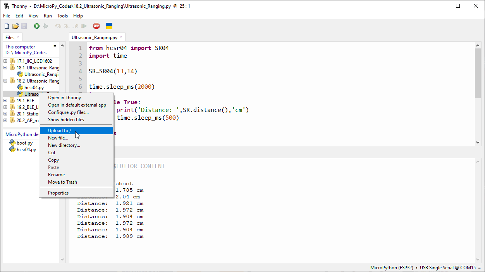
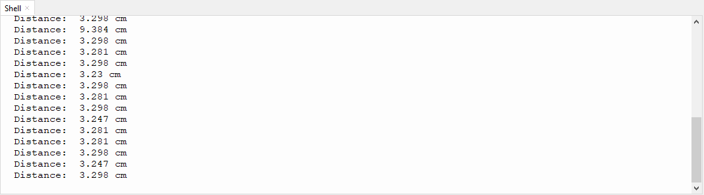

Chapter 18 Ultrasonic Ranging
==============================
In this chapter, we learn a module which use ultrasonic to measure distance, HC-SR04.

Project 18.1 Ultrasonic Ranging
------------------------------------
In this project, we use ultrasonic ranging module to measure distance, and print 
out the data in the terminal.

Component List
^^^^^^^^^^^^^^^
- ESP32-S3-WROOM x1
- GPIO Extension Board x1
- 830 Tie-Points Breadboard x1
- Ultrasonic Sensor x1
- F-M DuPont Cable x4

Connect
^^^^^^^^^^^^
Note that the voltage of ultrasonic module is 5V in the circuit.

Code
^^^^^^^
Move the program folder “Super_Starter_Kit_for_ESP32_S3/Python/Python_C
odes” to disk(D) in advance with the path of “D:/Micropython_Codes”.

Open “Thonny”, click “This computer” >> “D:” >> “Micropython_Codes” >> “18.1_Ultras
onic_Ranging” and double click “Ultrasonic_Ranging.py”.

**18.1_Ultrasonic_Ranging**

Click “Run current script”, you can use it to measure the distance between the 
ultrasonic module and the object. As shown in the following figure:

The following is the program code:

.. code-block:: python

    from machine import Pin
    import time

    trigPin=Pin(13,Pin.OUT,0)
    echoPin=Pin(14,Pin.IN,0)

    soundVelocity=340
    distance=0

    def getSonar():
        trigPin.value(1)
        time.sleep_us(10)
        trigPin.value(0)
        while not echoPin.value():
            pass
        pingStart=time.ticks_us()
        while echoPin.value():
            pass
        pingStop=time.ticks_us()
        pingTime=time.ticks_diff(pingStop,pingStart)
        distance=pingTime*soundVelocity//2//10000
        return int(distance)

    time.sleep_ms(2000)
    while True:
        time.sleep_ms(500)
        print('Distance: ',getSonar(),'cm' )

Project 18.2 Ultrasonic Ranging
----------------------------------
Component List and Connect
^^^^^^^^^^^^^^^^^^^^^^^^^^^^^
Component List and Connect are the same as the previous section

Code
^^^^^^^

Open “Thonny”, click “This computer” >> “D:” >> “Micropython_Codes” >> “18.2_Ultras
onic_Ranging”. Select “hcsr04.py”, right click your mouse to select “Upload to /”
, wait for “hcsr04.py” to be uploaded to ESP32-S3 and then double click “Ultrason
ic_Ranging.py”.

**18.2_Ultrasonic_Ranging**

Click “Run current script”. Use the ultrasonic module to measure distance. As 
shown in the following figure:

The following is the program code:

.. code-block:: python

    from machine import Pin
    import time

    soundVelocity=340
    distance=0

    class SR04(object):
        def __init__(self, trig: int=13, echo: int=14):
            self._trigPin = Pin(trig,Pin.OUT,0)
            self._echoPin = Pin(echo,Pin.IN,0)

        def distanceCM(self):
            self._trigPin.value(1)
            time.sleep_us(10)
            self._trigPin.value(0)    
            while(self._echoPin.value()==0):
                pass
            pingStart=time.ticks_us()
            while(self._echoPin.value()==1):
                pass
            pingStop=time.ticks_us()
            pingTime=time.ticks_diff(pingStop,pingStart)
            distance=pingTime*soundVelocity//2//10000
            return distance
        
        def distanceMM(self):
            self._trigPin.value(1)
            time.sleep_us(10)
            self._trigPin.value(0)    
            while(self._echoPin.value()==0):
                pass
            pingStart=time.ticks_us()
            while(self._echoPin.value()==1):
                pass
            pingStop=time.ticks_us()
            pingTime=time.ticks_diff(pingStop,pingStart)
            distance=pingTime*soundVelocity//2//1000
            return distance
        
        def distance(self):
            self._trigPin.value(1)
            time.sleep_us(10)
            self._trigPin.value(0)    
            while(self._echoPin.value()==0):
                pass
            pingStart=time.ticks_us()
            while(self._echoPin.value()==1):
                pass
            pingStop=time.ticks_us()
            pingTime=time.ticks_diff(pingStop,pingStart)
            distance=pingTime*soundVelocity/2/10000
            return distance
    

