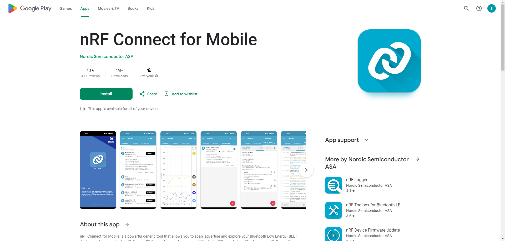
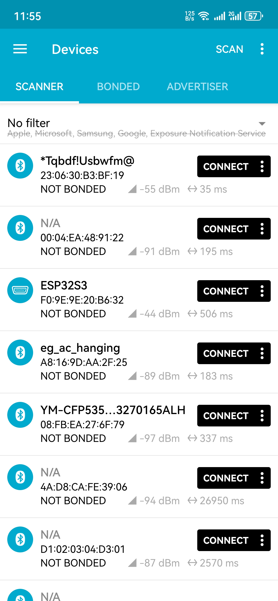
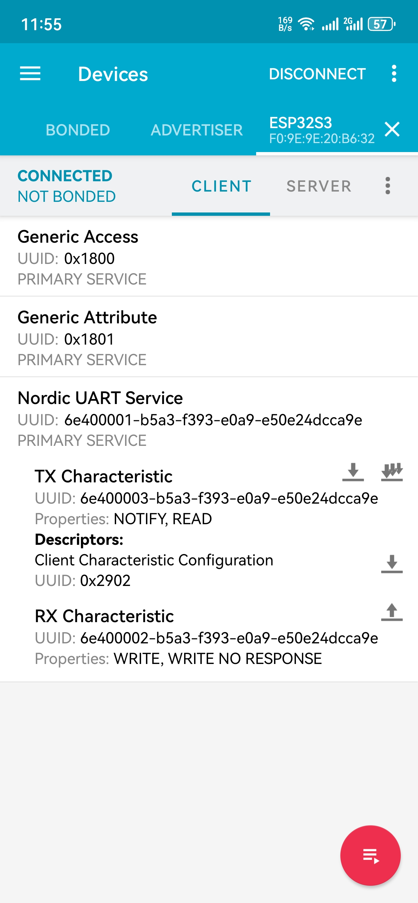
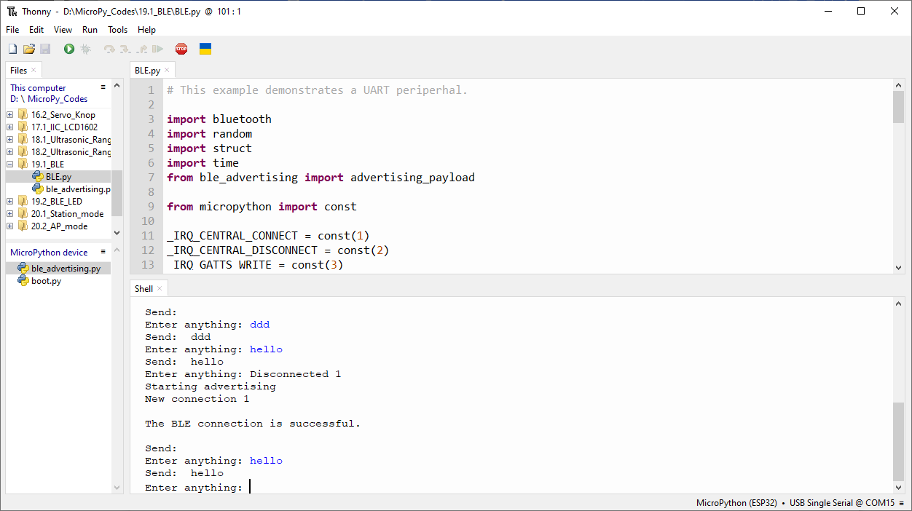
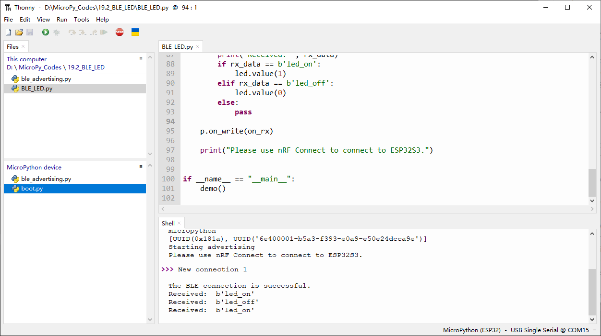

Chapter 19 Bluetooth
=========================
This chapter mainly introduces how to make simple data transmission through 
Bluetooth of ESP32-S3 WROOM and mobile phones.

Project 19.1 Bluetooth Low Energy Data Passthrough
---------------------------------------------------

Component List
^^^^^^^^^^^^^^^
- ESP32-S3-WROOM x1
- Type C USB Cable x1

Connect
^^^^^^^^^

.. image:: img/0/connect1.png

**nRF Connect**

In this class, we will use the nRF Connect software for Bluetooth debugging.

Android users can download it from this link:
`nRF Connect for Android <https://play.google.com/store/apps/details?id=no.nordicsemi.android.mcp&hl=en-US>`_

iPhone users can download it from this link:
`nRF Connect for iPhone <https://apps.apple.com/us/app/nrf-connect-for-mobile/id1054362403>`_

Code
^^^^^^^
Move the program folder “Super_Starter_Kit_for_ESP32_S3/Python/Python_C
odes” to disk(D) in advance with the path of “D:/Micropython_Codes”.

Open “Thonny”, click “This computer” >> “D:” >> “Micropython_Codes” >> “19.1_BLE”. 
Select “ble_advertising.py”, right click your mouse to select “Upload to /”, 
wait for “ble_advertising.py” to be uploaded to ESP32-S3 and then double click 
“BLE.py”.

**19.1_BLE**

.. image:: img/software/19.1.png

Click run for BLE.py.

Turn ON Bluetooth on your phone, and open the nrf-connect APP.

    
In the Scan page, swipe down to refresh the name of Bluetooth that the phone 
searches for. Click ESP32S3.

After Bluetooth is connect successfully, Shell will printer the information.

Click on “Nordic UART Service”. The TX characteristic shows the information you 
receive, and the RX characteristic is for sending information.

.. note:: 
    If nrf-connect is not receiving any messages, you can turn off the multi-arrow 
    to the right of the TX characteristic (it usually turns off automatically when messages are received).

You can type “Hello” in Shell and press “Enter” to send.

And then you can see the mobile Bluetooth has received the message.

Similarly, you can select the arrow to the right of the "RX characteristic" to 
send a message. Here, we enter "world" and click to send.

You can check the message from Bluetooth in “Shell”.

And now data can be transferred between your mobile phone and computer via ESP32S3.

The following is the program code:

.. code-block:: python

    # This example demonstrates a UART periperhal.

    import bluetooth
    import random
    import struct
    import time
    from ble_advertising import advertising_payload

    from micropython import const

    _IRQ_CENTRAL_CONNECT = const(1)
    _IRQ_CENTRAL_DISCONNECT = const(2)
    _IRQ_GATTS_WRITE = const(3)

    _FLAG_READ = const(0x0002)
    _FLAG_WRITE_NO_RESPONSE = const(0x0004)
    _FLAG_WRITE = const(0x0008)
    _FLAG_NOTIFY = const(0x0010)

    _UART_UUID = bluetooth.UUID("6E400001-B5A3-F393-E0A9-E50E24DCCA9E")
    _UART_TX = (
        bluetooth.UUID("6E400003-B5A3-F393-E0A9-E50E24DCCA9E"),
        _FLAG_READ | _FLAG_NOTIFY,
    )
    _UART_RX = (
        bluetooth.UUID("6E400002-B5A3-F393-E0A9-E50E24DCCA9E"),
        _FLAG_WRITE | _FLAG_WRITE_NO_RESPONSE,
    )
    _UART_SERVICE = (
        _UART_UUID,
        (_UART_TX, _UART_RX),
    )

    class BLESimplePeripheral:
        def __init__(self, ble, name="ESP32S3"):
            self._ble = ble
            self._ble.active(True)
            self._ble.irq(self._irq)
            ((self._handle_tx, self._handle_rx),) = self._ble.gatts_register_services((_UART_SERVICE,))
            self._connections = set()   
            self._write_callback = None
            self._payload = advertising_payload(name=name, services=[_UART_UUID])
            self._advertise()

        def _irq(self, event, data):
            # Track connections so we can send notifications.
            if event == _IRQ_CENTRAL_CONNECT:
                conn_handle, _, _ = data
                print("New connection", conn_handle)
                print("\nThe BLE connection is successful.")
                self._connections.add(conn_handle)
            elif event == _IRQ_CENTRAL_DISCONNECT:
                conn_handle, _, _ = data
                print("Disconnected", conn_handle)
                self._connections.remove(conn_handle)
                # Start advertising again to allow a new connection.
                self._advertise()
            elif event == _IRQ_GATTS_WRITE:
                conn_handle, value_handle = data
                value = self._ble.gatts_read(value_handle)
                if value_handle == self._handle_rx and self._write_callback:
                    self._write_callback(value)

        def send(self, data):
            for conn_handle in self._connections:
                self._ble.gatts_notify(conn_handle, self._handle_tx, data)

        def is_connected(self):
            return len(self._connections) > 0

        def _advertise(self, interval_us=500000):
            print("Starting advertising")
            self._ble.gap_advertise(interval_us, adv_data=self._payload)

        def on_write(self, callback):
            self._write_callback = callback

    def demo():
        ble = bluetooth.BLE()
        p = BLESimplePeripheral(ble)

        def on_rx(rx_data):
            print("\nRX", rx_data)

        p.on_write(on_rx)
        
        print("Please use nRF Connect to connect to ESP32S3.")

        while True:
            if p.is_connected():
                # Short burst of queued notifications.
                tx_data = input("Enter anything: ")
                print("Send: ", tx_data)
                p.send(tx_data)

    if __name__ == "__main__":
        demo()

Project 19.2 Bluetooth Control LED
--------------------------------------
In this section, we will control the LED with Bluetooth.

Component List
^^^^^^^^^^^^^^^
- ESP32-S3-WROOM x1
- GPIO Extension Board x1
- 830 Tie-Points Breadboard x1
- Resistor 220Ω  x1
- LED x1
- Jumper Wire x2
- Type C USB Cable x1

Connect
^^^^^^^
Connect ESP32-S3 to the computer using a USB cable.

.. image:: img/connect/1.png

Code
^^^^^^
Move the program folder  “Super_Starter_Kit_for_ESP32_S3/Python/Python_Codes”  to disk(D) 
in advance with the path of  “D:/Micropython_Codes”.
Open  “Thonny”, click “This computer” >> “D:” >> “Micropython_Codes” >> “19.2_BL
E_LED”. Select “ble_advertising.py”, right click your mouse to select  “Upload t
o /”, wait for “ble_advertising.py”  to be uploaded to ESP32-S3 and then double 
click  “BLE_LED.py”

**19.2_BLE_LED**

.. image:: img/software/19.2.png

Compile and upload code to ESP32S3. The operation of the APP is the same as 19.1, you only need to change 
the sending content to "led_on" and "led_off" to operate LEDs on the ESP32S3.

Data sent from mobile APP: 

You can check the message sent by Bluetooth in “Shell”.

The phenomenon of LED

.. image:: img/phenomenon/19.2.png

Attention: If the sending content isn't "led_on' or "led_off", then the state of 
LED will not change. If the LED is on, when receiving irrelevant content, it 
keeps on; Correspondingly, if the LED is off, when receiving irrelevant content, 
it keeps off.

The following is the program code:

.. code-block:: python

    # This example demonstrates a UART periperhal.

    import bluetooth
    import random
    import struct
    import time
    from ble_advertising import advertising_payload
    from machine import Pin
    from micropython import const

    _IRQ_CENTRAL_CONNECT = const(1)
    _IRQ_CENTRAL_DISCONNECT = const(2)
    _IRQ_GATTS_WRITE = const(3)

    _FLAG_READ = const(0x0002)
    _FLAG_WRITE_NO_RESPONSE = const(0x0004)
    _FLAG_WRITE = const(0x0008)
    _FLAG_NOTIFY = const(0x0010)

    _UART_UUID = bluetooth.UUID("6E400001-B5A3-F393-E0A9-E50E24DCCA9E")
    _UART_TX = (
        bluetooth.UUID("6E400003-B5A3-F393-E0A9-E50E24DCCA9E"),
        _FLAG_READ | _FLAG_NOTIFY,
    )
    _UART_RX = (
        bluetooth.UUID("6E400002-B5A3-F393-E0A9-E50E24DCCA9E"),
        _FLAG_WRITE | _FLAG_WRITE_NO_RESPONSE,
    )
    _UART_SERVICE = (
        _UART_UUID,
        (_UART_TX, _UART_RX),
    )

    class BLESimplePeripheral:
        def __init__(self, ble, name="ESP32S3"):
            self._ble = ble
            self._ble.active(True)
            self._ble.irq(self._irq)
            ((self._handle_tx, self._handle_rx),) = self._ble.gatts_register_services((_UART_SERVICE,))
            self._connections = set()   
            self._write_callback = None
            self._payload = advertising_payload(name=name, services=[_UART_UUID])
            self._advertise()

        def _irq(self, event, data):
            # Track connections so we can send notifications.
            if event == _IRQ_CENTRAL_CONNECT:
                conn_handle, _, _ = data
                print("New connection", conn_handle)
                print("\nThe BLE connection is successful.")
                self._connections.add(conn_handle)
            elif event == _IRQ_CENTRAL_DISCONNECT:
                conn_handle, _, _ = data
                print("Disconnected", conn_handle)
                self._connections.remove(conn_handle)
                # Start advertising again to allow a new connection.
                self._advertise()
            elif event == _IRQ_GATTS_WRITE:
                conn_handle, value_handle = data
                value = self._ble.gatts_read(value_handle)
                if value_handle == self._handle_rx and self._write_callback:
                    self._write_callback(value)

        def send(self, data):
            for conn_handle in self._connections:
                self._ble.gatts_notify(conn_handle, self._handle_tx, data)

        def is_connected(self):
            return len(self._connections) > 0

        def _advertise(self, interval_us=500000):
            print("Starting advertising")
            self._ble.gap_advertise(interval_us, adv_data=self._payload)

        def on_write(self, callback):
            self._write_callback = callback

    def demo():
        ble = bluetooth.BLE()
        p = BLESimplePeripheral(ble)
        
        led=Pin(2,Pin.OUT)
        
        def on_rx(rx_data):
            print("Received: ", rx_data)
            if rx_data == b'led_on':
                led.value(1)
            elif rx_data == b'led_off':
                led.value(0)
            else:
                pass

        p.on_write(on_rx)
        
        print("Please use nRF Connect to connect to ESP32S3.")

    if __name__ == "__main__":
        demo()
