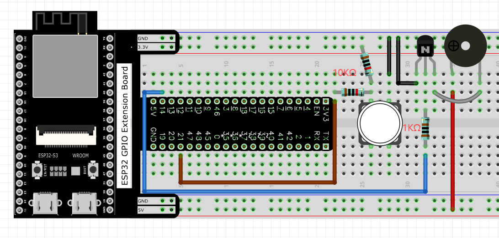
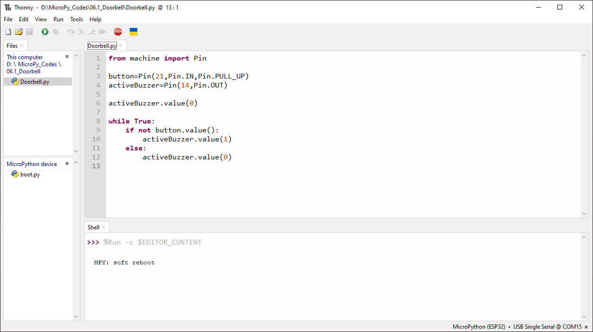
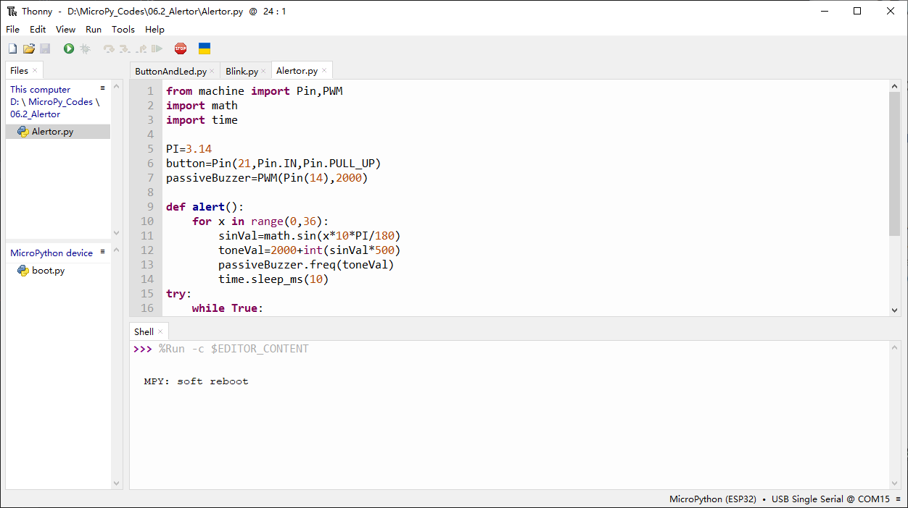

Chapter 6 Buzzer
=========================
In this chapter, we will learn about buzzers that can make sounds.

Project 6.1 Doorbell
----------------------
We will make this kind of doorbell: when the button is pressed, the buzzer sounds; 
and when the button is released, the buzzer stops sounding.

Component List
^^^^^^^^^^^^^^^
- ESP32-S3-WROOM x1
- GPIO Extension Board x1
- 830 Tie-Points Breadboard x1
- NPN transistor(S8050) x2
- Active Buzzer x1
- Resistor 10kΩ x2
- Resistor 1kΩ  x1
- Button x1
- Jumper Wire x6

Component knowledge
^^^^^^^^^^^^^^^^^^^^
:ref:`transistor <cpn_transistor>`
"""""""""""""""""""""""""""""""""""

:ref:`Buzzer <cpn_buzzer>`
"""""""""""""""""""""""""""

Connect
^^^^^^^^^

Code
^^^^^^^
In this project, a buzzer will be controlled by a push button switch. When the 
button switch is pressed, the buzzer sounds and when the button is released, the 
buzzer stops. It is analogous to our earlier project that controlled an LED ON 
and OFF.

Move the program folder “Super_Starter_Kit_for_ESP32_S3/Python/Python_C
odes” to disk(D) in advance with the path of “D:/Micropython_Codes”.

Open “Thonny”, click “This computer” >> “D:” >> “Micropython_Codes” >> “06.1_Doorbe
ll” and double click “Doorbell.py”.

**06.1_Doorbell**

Click “Run current script”, press the push button switch and the buzzer will sound. 
Release the push button switch and the buzzer will stop.

.. image:: img/phenomenon/6.1.png

The following is the program code:

.. code-block:: python

    from machine import Pin

    button=Pin(21,Pin.IN,Pin.PULL_UP)
    activeBuzzer=Pin(14,Pin.OUT)

    activeBuzzer.value(0)

    while True:
        if not button.value():
            activeBuzzer.value(1)
        else:
            activeBuzzer.value(0)

Project 6.2 Alertor
----------------------
Next, we will use a passive buzzer to make an alarm. Component list and the circuit 
is similar to the last section. In the Doorbell circuit only the active buzzer 
needs to be replaced with a passive buzzer.

Code
^^^^^^^
In this project, the buzzer alarm is controlled by the button. Press the button, 
then buzzer sounds. If you release the button, the buzzer will stop sounding. 

In the logic, it is the same as using button to control LED. In the control 
method, passive buzzer requires PWM of certain frequency to sound.

Open “Thonny”, click “This computer” >> “D:” >> “Micropython_Codes” >> “06.2_Alerto
r”，and double click “Alertor.py”.

**06.2_Alertor**

Click “Run current script”, press the button, then alarm sounds. And when the 
button is release, the alarm will stop sounding.

.. image:: img/phenomenon/6.1.png

The following is the program code:

.. code-block:: python

    from machine import Pin,PWM
    import math
    import time

    PI=3.14
    button=Pin(21,Pin.IN,Pin.PULL_UP)
    passiveBuzzer=PWM(Pin(14),2000)

    def alert():
        for x in range(0,36):
            sinVal=math.sin(x*10*PI/180)
            toneVal=2000+int(sinVal*500)
            passiveBuzzer.freq(toneVal)
            time.sleep_ms(10)
    try:
        while True:
            if not button.value():
                passiveBuzzer.init()
                alert()   
            else:
                passiveBuzzer.deinit()
    except:
        passiveBuzzer.deinit()

