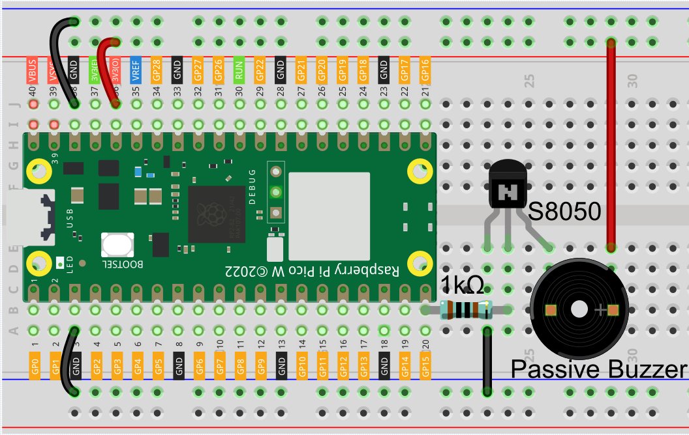

2.2 Custom Melody
=========================
In our previous project, we used an active buzzer, but this time we'll switch to 
a passive buzzer. Similar to the active buzzer, the passive buzzer operates based 
on electromagnetic induction. However, unlike the active buzzer, the passive buzzer 
lacks an internal oscillation source, meaning it won't produce sound with a simple 
DC signal. This feature, however, allows the passive buzzer to adjust its own 
oscillation frequency, enabling it to produce different musical notes like “doh, 
re, mi, fa, sol, la, ti.” Let's make the passive buzzer play a melody!

Component List
^^^^^^^^^^^^^^^
- Raspberry Pi Pico W x1
- 830 Tie-Points Breadboard x1
- Transistor S8050 x1
- Resistor 1KΩ x1
- Passive Buzzer x1
- Jumper Wire Several

Component knowledge
^^^^^^^^^^^^^^^^^^^^

:ref:`transistor <cpn_transistor>`
"""""""""""""""""""""""""""""""""""

:ref:`Buzzer <cpn_buzzer>`
"""""""""""""""""""""""""""

Schematic
^^^^^^^^^^
.. image:: img/2.sch/2.2.png
    
When GP15 outputs a high signal, the 1K resistor limits the current to protect the 
transistor. The S8050 (NPN transistor) then conducts, allowing the buzzer to sound. 
The S8050 transistor amplifies the current, resulting in a louder sound from the 
buzzer. While you can connect the buzzer directly to GP15, the sound will be quieter 
without the transistor.

Connect
^^^^^^^^
Two buzzers are included in the kit, we use a passive buzzer (one with an exposed PCB on the back).

The buzzer needs a transistor to work, here we use S8050.

Code
^^^^^^^
.. note::

    * Open the ``2.2_beep.py`` file under the path of ``Ultimate-Starter-Kit-for-Pico\Python\1.Project`` or copy this code into Thonny, then click "Run Current Script" or simply press F5 to run it.

    * Don't forget to click on the "MicroPython (Raspberry Pi Pico)" interpreter in the bottom right corner. 

Click “Run current script”, you will hear a beep every second.

.. image:: img/5.phenomenon/2.2.png

The following is the program code:

.. code-block:: python

    import machine
    import utime

    buzzer = machine.Pin(15, machine.Pin.OUT)
    while True:
        for i in range(4):
            buzzer.value(1)
            utime.sleep(0.3)
            buzzer.value(0)
            utime.sleep(0.3)
        utime.sleep(1)

Phenomenon
^^^^^^^^^^^
.. image:: img/5.phenomenon/2.2.png
    :width: 100%