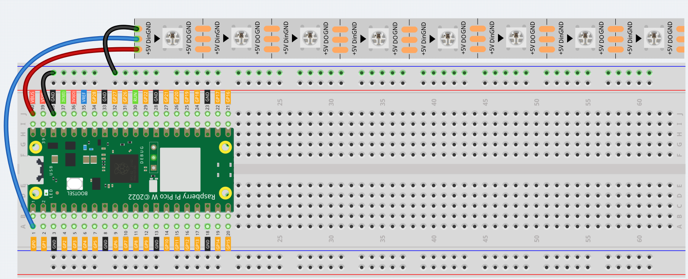

2.3 RGB LED Strip
=========================
WS2812 is a intelligent control LED light source that the control circuit and RGB 
chip are integrated in a package of 5050 components. It internal include intelligent 
digital port data latch and signal reshaping amplification drive circuit. Also 
include a precision internal oscillator and a programmable constant current control 
part, effectively ensuring the pixel point light color height consistent.

The data transfer protocol use single NZR communication mode. After the pixel power-on 
reset, the DIN port receive data from controller, the first pixel collect initial 
24bit data then sent to the internal data latch, the other data which reshaping 
by the internal signal reshaping amplification circuit sent to the next cascade 
pixel through the DO port. After transmission for each pixel, the signal to reduce 
24bit. pixel adopt auto reshaping transmit technology, making the pixel cascade 
number is not limited the signal transmission, only depend on the speed of signal 
transmission.

Component List
^^^^^^^^^^^^^^^
- Raspberry Pi Pico W x1
- MicroUSB cable x1
- 830 Tie-Points Breadboard x1
- RGB 8 LED Strip x1
- Jumper Wire Several

Component knowledge
^^^^^^^^^^^^^^^^^^^^

:ref:`transistor <cpn_transistor>`
"""""""""""""""""""""""""""""""""""

Schematic
^^^^^^^^^^
.. image:: img/2.sch/2.3.png

Connect
^^^^^^^^^

.. warning:: 
    One thing you need to pay attention to is current.

    Although the LED Strip with any number of LEDs can be used in Pico W, the power 
    of its VBUS pin is limited. Here, we will use eight LEDs, which are safe. But if 
    you want to use more LEDs, you need to add a separate power supply.

Code
^^^^^^^
.. note::

    * Open the ``2.3_rgb_led_strip.py`` file under the path of ``Ultimate-Starter-Kit-for-Pico\Python\1.Project`` or copy this code into Thonny, then click "Run Current Script" or simply press F5 to run it.

    * Don't forget to click on the "MicroPython (Raspberry Pi Pico)" interpreter in the bottom right corner. 

.. image:: img/4.software/2.3.png

Click “Run current script”, Let’s select some favorite colors and display them on the RGB LED Strip!

The following is the program code:

.. code-block:: python

    import machine
    from ws2812 import WS2812

    ws = WS2812(machine.Pin(0),8)

    ws[0] = [64,154,227]
    ws[1] = [128,0,128]
    ws[2] = [50,150,50]
    ws[3] = [255,30,30]
    ws[4] = [0,128,255]
    ws[5] = [99,199,0]
    ws[6] = [128,128,128]
    ws[7] = [255,100,0]
    ws.write()

Phenomenon
^^^^^^^^^^^
.. image:: img/5.phenomenon/2.3.png
    :width: 100%