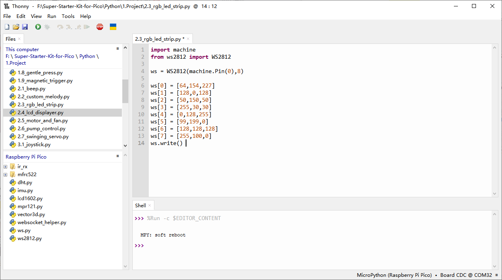

2.3 RGB LED Strip
=========================
The WS2812 is an intelligent LED light source that integrates a control circuit 
and an RGB chip within a 5050 package. It features an intelligent digital port with 
a data latch and a signal reshaping amplification drive circuit. Additionally, it 
includes a precision oscillator and a programmable constant current control, ensuring 
consistent color output across each pixel.

The data transfer protocol relies on a single-line NRZ (Non-Return-to-Zero) communication 
mode. Upon power-on reset, the DIN port receives data from the controller. The first pixel 
captures the initial 24-bit data and sends it to its internal latch, while the remaining 
data is reshaped by the internal amplification circuit and forwarded to the next pixel via 
the DO port. With each pixel, the signal is reduced by 24 bits. The WS2812 uses auto-reshaping 
transmission technology, allowing for unlimited pixel cascading, limited only by the speed of 
signal transmission.

Component List
^^^^^^^^^^^^^^^
- Raspberry Pi Pico W x1
- MicroUSB cable x1
- 830 Tie-Points Breadboard x1
- RGB 8 LED Strip x1
- Jumper Wire Several

Component knowledge
^^^^^^^^^^^^^^^^^^^^
:ref:`RGB 8 LED Strip <cpn_rgb_led_strip>`
"""""""""""""""""""""""""""""""""""""""""""

Schematic
^^^^^^^^^^
.. image:: img/2.sch/2.3.png

Connect
^^^^^^^^^

.. warning:: 
    One thing you need to pay attention to is current.

    Although the LED Strip with any number of LEDs can be used in Pico W, the power 
    of its VBUS pin is limited. Here, we will use eight LEDs, which are safe. But if 
    you want to use more LEDs, you need to add a separate power supply.

Code
^^^^^^^
.. note::

    * Open the ``2.3_rgb_led_strip.py`` file under the path of ``Ultimate-Starter-Kit-for-Pico\Python\1.Project`` or copy this code into Thonny, then click "Run Current Script" or simply press F5 to run it.

    * Don't forget to click on the "MicroPython (Raspberry Pi Pico)" interpreter in the bottom right corner. 

Click “Run current script”, Let’s select some favorite colors and display them on the RGB LED Strip!

The following is the program code:

.. code-block:: python

    import machine
    from ws2812 import WS2812

    ws = WS2812(machine.Pin(0),8)

    ws[0] = [64,154,227]
    ws[1] = [128,0,128]
    ws[2] = [50,150,50]
    ws[3] = [255,30,30]
    ws[4] = [0,128,255]
    ws[5] = [99,199,0]
    ws[6] = [128,128,128]
    ws[7] = [255,100,0]
    ws.write()

Phenomenon
^^^^^^^^^^^
.. image:: img/5.phenomenon/2.3.png
    :width: 100%