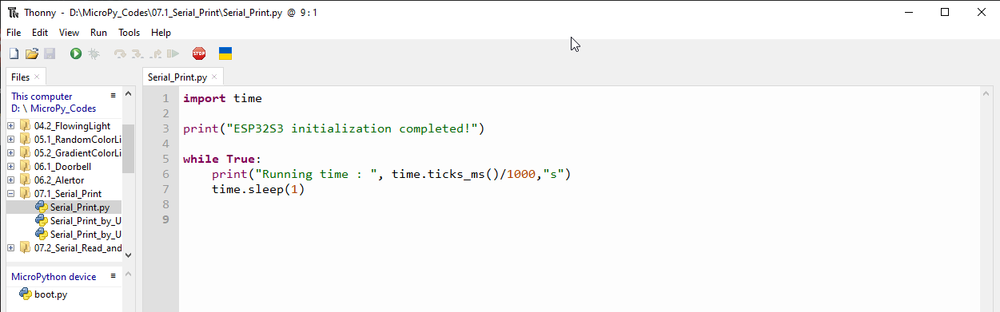
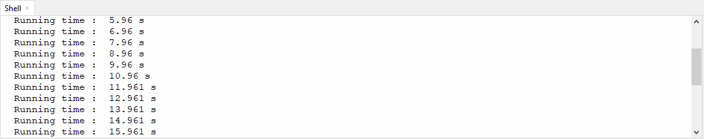
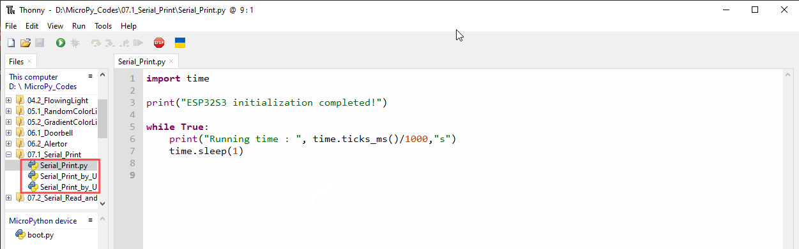
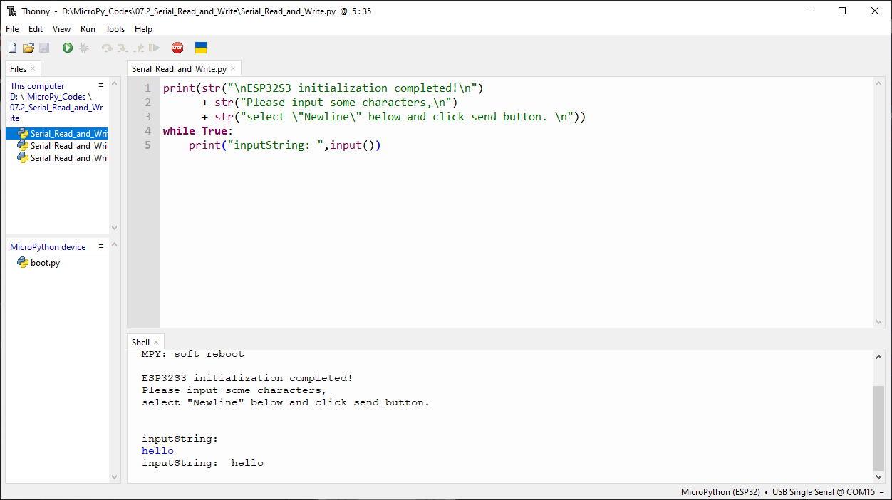
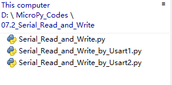

Chapter 7 Serial Communication
=================================
Serial Communication is a means of communication between different devices/devices. 
This section describes ESP32-S3’s Serial Communication

Project 7.1 Serial Print
------------------------
This project uses ESP32-S3’s serial communicator to send data to the computer and 

print it on the serial monitor.

Component List
^^^^^^^^^^^^^^^
- ESP32-S3-WROOM x1
- GPIO Extension Board x1
- Type C USB Cable x1

Connect
^^^^^^^^^
Connect ESP32-S3 to the computer with USB cable.

.. image:: img/0/connect1.png

Code
^^^^^^^
Move the program folder “Super_Starter_Kit_for_ESP32_S3/Python/Python_C
odes” to disk(D) in advance with the path of “D:/Micropython_Codes”.

Open “Thonny”, click “This computer” >> “D:” >> “Micropython_Codes” >> “07.1_Seri
al_Print” and double “Serial_Print.py”.

**07.1_Serial_Print**

Click “Run current script” and observe the changes of “Shell”, which will display 
the time when ESP32-S3 is powered on once per second.

The following is the program code:

.. code-block:: python

    import time

    print("ESP32S3 initialization completed!")

    while True:
        print("Running time : ", time.ticks_ms()/1000,"s")
        time.sleep(1)

ESP32-S3 has 3 serial ports, one of which is used as REPL, that is, Pin(43) and 
Pin(44) are occupied, and generally it is not recommended to be used as tx, rx. 
The other two serial ports can be configured simply by calling the UART module.

Project 7.2 Serial Read and Write
------------------------------------
From last section, we use serial port on ESP32-S3 to send data to a com
puter, now we will use that to receive data from computer. 

Component and circuit are the same as in the previous project.

Code
^^^^^^
Open “Thonny”, click “This computer” >> “D:” >> “Micropython_Codes” >> “07.2_Seria
l_Read_and_Write” and double click “Serial_Read_and_Write.py”.

**07.2_Serial_Read_and_Write**

Click “Run current script” and ESP32-S3 will print out data at “Shell” and wait 
for users to enter any messages. Press Enter to end the input, and “Shell” will 
print out data that the user entered. If you want to use other serial ports, you 
can use other python files in the same directory.

