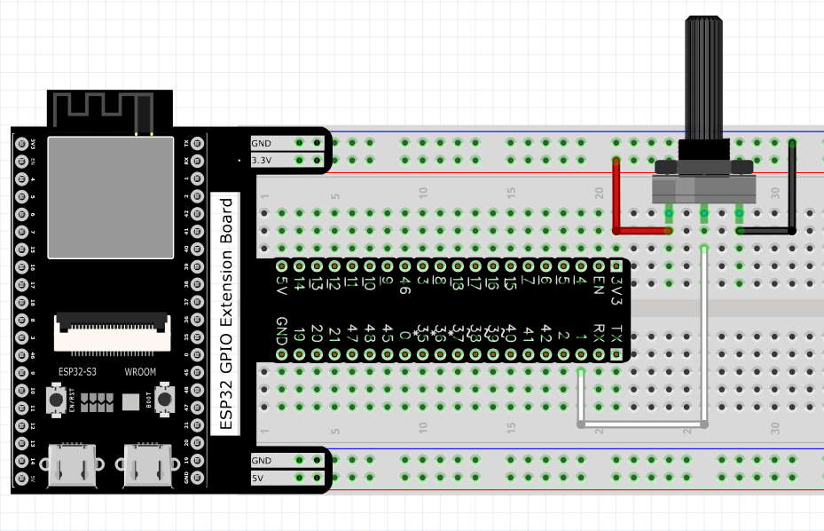
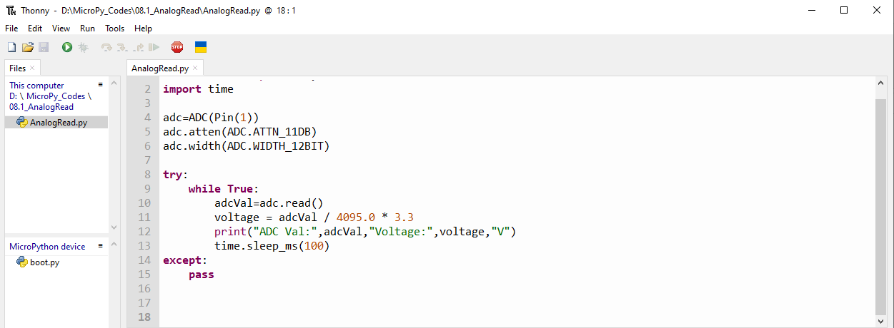
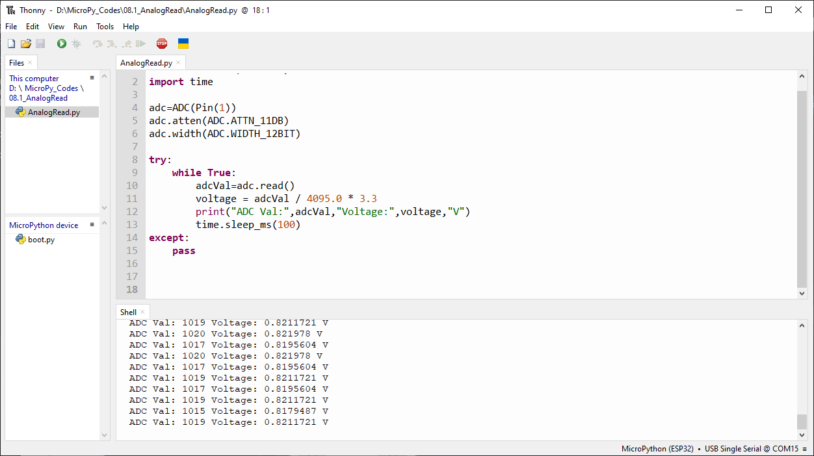

Chapter 8 AD Converter
========================
In this chapter, we will learn how to use ESP32-S3 to read analog signals.

Project 8.1 Read the Voltage of Potentiometer
------------------------------------------------
In this project, we will use the ADC function of ESP32-S3 to read the voltage value 
of the potentiometer and print it out through the serial monitor.

Component List
^^^^^^^^^^^^^^^
- ESP32-S3-WROOM x1
- GPIO Extension Board x1
- 830 Tie-Points Breadboard x1
- Potentiometer(10k) x1
- Jumper Wire x3

Component knowledge
^^^^^^^^^^^^^^^^^^^^
:ref:`Potentiometer <cpn_potentiometer>`
""""""""""""""""""""""""""""""""""""""""""
  
Connect
^^^^^^^^^

Code
^^^^^^^
Move the program folder “Super_Starter_Kit_for_ESP32_S3/Python/Python_C
odes” to disk(D) in advance with the path of “D:/Micropython_Codes”.

Open “Thonny”, click “This computer” >> “D:” >> “Micropython_Codes” >> “08.1_Analog
Read and then click “AnalogRead.py”.

**08.1_AnalogRead**

Click “Run current script” and observe the message printed in “Shell”.

The following is the program code:

.. code-block:: python

    from machine import ADC,Pin
    import time

    adc=ADC(Pin(1))
    adc.atten(ADC.ATTN_11DB)
    adc.width(ADC.WIDTH_12BIT)

    try:
        while True:
            adcVal=adc.read()
            voltage = adcVal / 4095.0 * 3.3
            print("ADC Val:",adcVal,"Voltage:",voltage,"V")
            time.sleep_ms(100)
    except:
        pass
