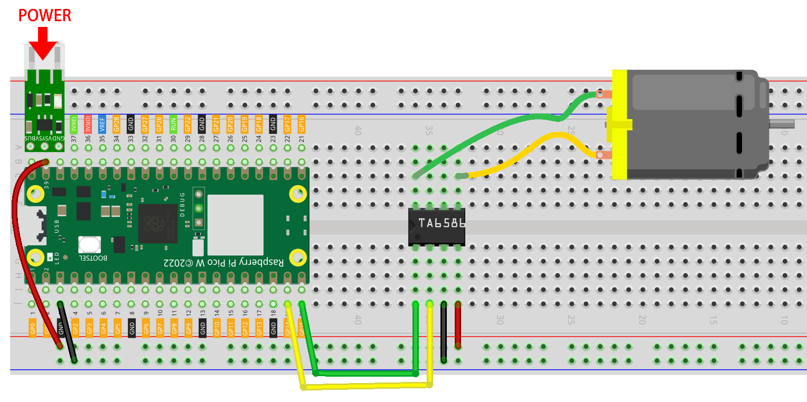
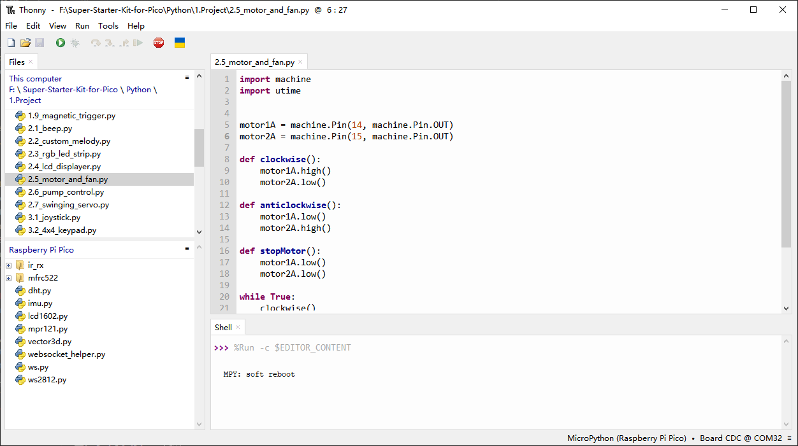

2.5 Motor & Fan
=========================
We're now using the TA6586 to control the DC motor, enabling it to rotate both 
clockwise and counterclockwise. Given that DC motors typically require a significant 
amount of current, we're employing a dedicated power module to safely supply power 
to the motor.

Component List
^^^^^^^^^^^^^^^
- Raspberry Pi Pico W x1
- MicroUSB cable x1
- 830 Tie-Points Breadboard x1
- TA6586 x1
- DC Motor x1
- Li-po Charger Module x1
- Battery Holder x1
- Jumper Wire Several

Component knowledge
^^^^^^^^^^^^^^^^^^^^
:ref:`TA6586 <cpn_ta6586>`
"""""""""""""""""""""""""""

:ref:`Li-po Charger Module <cpn_li-po_charger_module>`
"""""""""""""""""""""""""""""""""""""""""""""""""""""""""

:ref:`DC Motor <cpn_dc_motor>`
""""""""""""""""""""""""""""""""

Schematic
^^^^^^^^^^
.. image:: img/2.sch/2.5.png

.. note:: 

    * Since DC motors require a high current, we use a Li-po Charger module to power the motor here for safety reasons.

    * Make sure your Li-po Charger Module is connected as shown in the diagram. Otherwise, a short circuit will likely damage your battery and circuitry.

Connect
^^^^^^^^^

Code
^^^^^^^
.. note::

    * Open the ``2.5_motor_and_fan.py`` file under the path of ``Ultimate-Starter-Kit-for-Pico\Python\1.Project`` or copy this code into Thonny, then click "Run Current Script" or simply press F5 to run it.

    * Don't forget to click on the "MicroPython (Raspberry Pi Pico)" interpreter in the bottom right corner. 

Click “Run current script”, the motor will rotate back and forth in a regular pattern.

The following is the program code:

.. code-block:: python

    import machine
    import utime
            
    motor1A = machine.Pin(14, machine.Pin.OUT)
    motor2A = machine.Pin(15, machine.Pin.OUT)

    def clockwise():
        motor1A.high()
        motor2A.low()

    def anticlockwise():
        motor1A.low()
        motor2A.high()

    def stopMotor():
        motor1A.low()
        motor2A.low()

    while True:
        clockwise()
        utime.sleep(1)
        stopMotor()
        utime.sleep(1)
        anticlockwise()
        utime.sleep(1)
        stopMotor()
        utime.sleep(1)

Phenomenon
^^^^^^^^^^^
.. video:: img/5.phenomenon/2.5.mp4
    :width: 100%