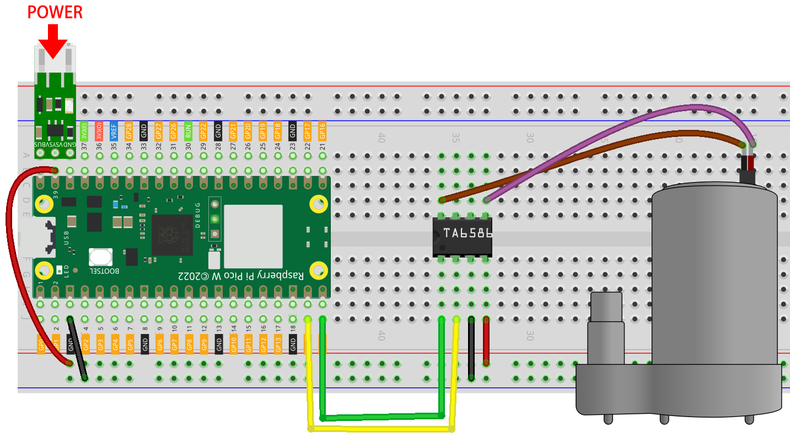
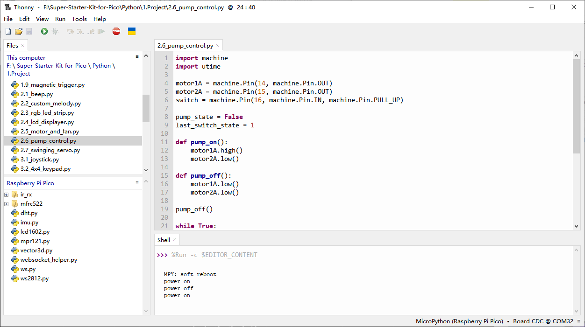

2.6 Pump Control
=========================
Small centrifugal pumps are suitable for projects with automatic plant watering. It can also be used to make tiny smart water features.

Its power component is an electric motor, driven in exactly the same way as a normal motor.

.. note:: 
    
    1.Connect the tube to the motor outlet, submerge the pump in water, and then power it on.
    2.You need to make sure that the water level is always higher than the motor. Idling may damage the motor due to heat generation and will also generate noise.
    3.If you are watering plants, you need to avoid soil being drawn in, as this can clog the pump.
    4.If water does not come out of the tube, there may be residual water in the tube blocking the air flow and needs to be drained first.

Component List
^^^^^^^^^^^^^^^
- Raspberry Pi Pico W x1
- 830 Tie-Points Breadboard x1
- Transistor S8050 x1
- TA6586 x1
- DC Water Pump
- Li-po Charger Module x1
- Battery Holder
- Jumper Wire Several

Component knowledge
^^^^^^^^^^^^^^^^^^^^

:ref:`transistor <cpn_transistor>`
"""""""""""""""""""""""""""""""""""

:ref:`Buzzer <cpn_buzzer>`
"""""""""""""""""""""""""""

Schematic
^^^^^^^^^^
.. image:: img/2.sch/2.6.png

.. note:: 

    * Since DC pump require a high current, we use a Li-po Charger module to power the motor here for safety reasons.

    * Make sure your Li-po Charger Module is connected as shown in the diagram. Otherwise, a short circuit will likely damage your battery and circuitry.

Connect
^^^^^^^^^

Code
^^^^^^^
.. note::

    * Open the ``2.6_pump_control.py`` file under the path of ``Super-Starter-Kit-for-Pico\Python\1.Project`` or copy this code into Thonny, then click "Run Current Script" or simply press F5 to run it.

    * Don't forget to click on the "MicroPython (Raspberry Pi Pico)" interpreter in the bottom right corner. 

Click “Run current script”, xxx

The following is the program code:

.. code-block:: python

    import machine
    import utime

    motor1A = machine.Pin(14, machine.Pin.OUT)
    motor2A = machine.Pin(15, machine.Pin.OUT)

    while True:
        motor1A.high()
        motor2A.low()

Phenomenon
^^^^^^^^^^^
.. image:: img/5.phenomenon/x.mp4
    :width: 100%