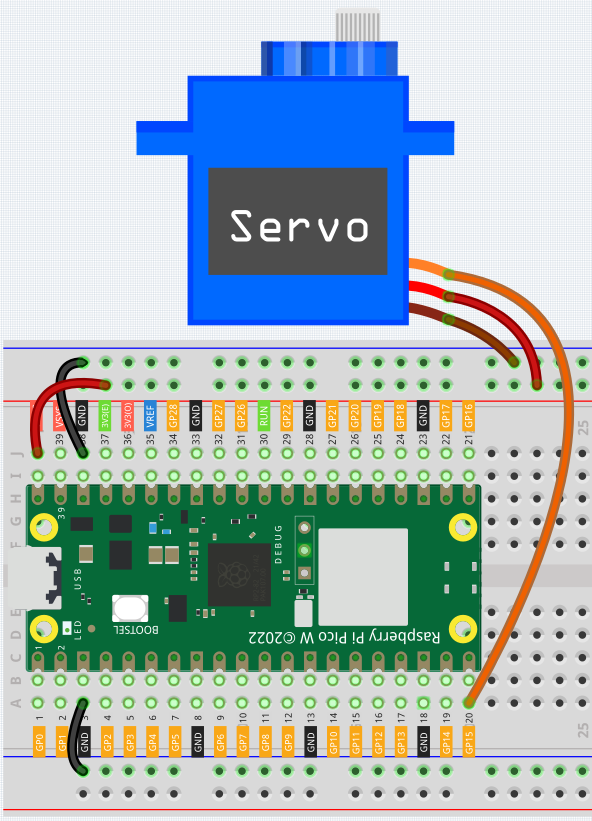
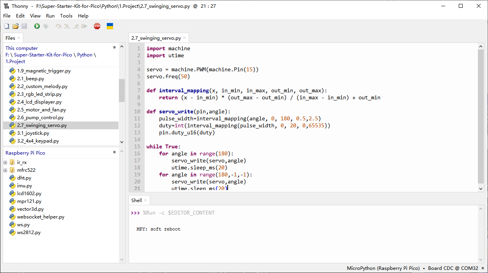

2.7 Swinging Servo
=========================
In this kit, besides the LED and passive buzzer, there’s also a servo motor that’s 
controlled by a PWM signal. A servo is a type of position (angle) control device, 
perfect for systems that require continuous angle adjustments and the ability to 
maintain specific positions. It’s widely used in high-end remote-controlled toys, 
including model airplanes, submarines, and robotic devices.

Now, let’s try making the servo motor swing back and forth!

Component List
^^^^^^^^^^^^^^^
- Raspberry Pi Pico W x1
- MicroUSB cable x1
- 830 Tie-Points Breadboard x1
- Servo x1
- Jumper Wire Several

Component knowledge
^^^^^^^^^^^^^^^^^^^^

:ref:`Servo <cpn_servo>`
""""""""""""""""""""""""""

Schematic
^^^^^^^^^^
.. image:: img/2.sch/2.7.png

Connect
^^^^^^^^^

* Orange wire is signal and connected to GP15.

* Red wire is VCC and connected to VBUS(5V).

* Brown wire is GND and connected to GND.

Code
^^^^^^^
.. note::

    * Open the ``2.7_swinging_servo.py`` file under the path of ``Ultimate-Starter-Kit-for-Pico\Python\1.Project`` or copy this code into Thonny, then click "Run Current Script" or simply press F5 to run it.

    * Don't forget to click on the "MicroPython (Raspberry Pi Pico)" interpreter in the bottom right corner. 

Click “Run current script”, we can see the Servo Arm swinging back and forth from 0° to 180°.

The program will always run because of the while True loop, we need to press the Stop button to end the program.

The following is the program code:

.. code-block:: python

    import machine
    import utime

    servo = machine.PWM(machine.Pin(15))
    servo.freq(50)

    def interval_mapping(x, in_min, in_max, out_min, out_max):
        return (x - in_min) * (out_max - out_min) / (in_max - in_min) + out_min

    def servo_write(pin,angle):
        pulse_width=interval_mapping(angle, 0, 180, 0.5,2.5)
        duty=int(interval_mapping(pulse_width, 0, 20, 0,65535))
        pin.duty_u16(duty)

    while True:
        for angle in range(180):
            servo_write(servo,angle)
            utime.sleep_ms(20)
        for angle in range(180,-1,-1):
            servo_write(servo,angle)
            utime.sleep_ms(20)

Phenomenon
^^^^^^^^^^^
.. video:: img/5.phenomenon/2.7.mp4
    :width: 100%