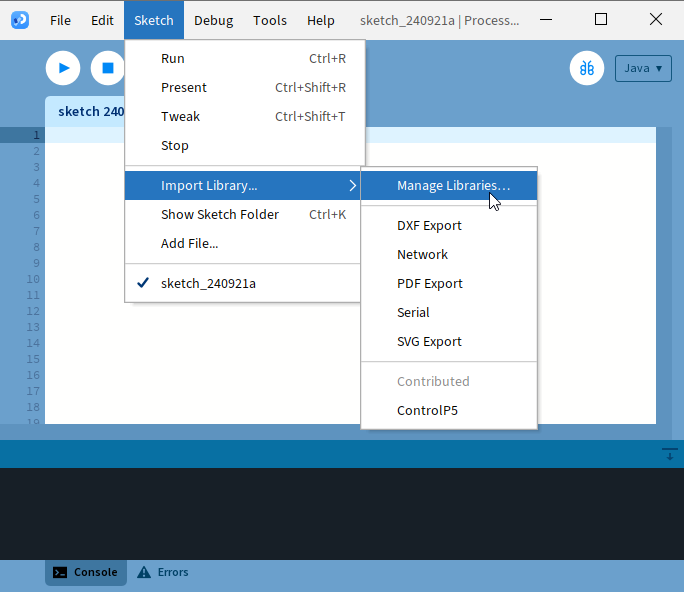
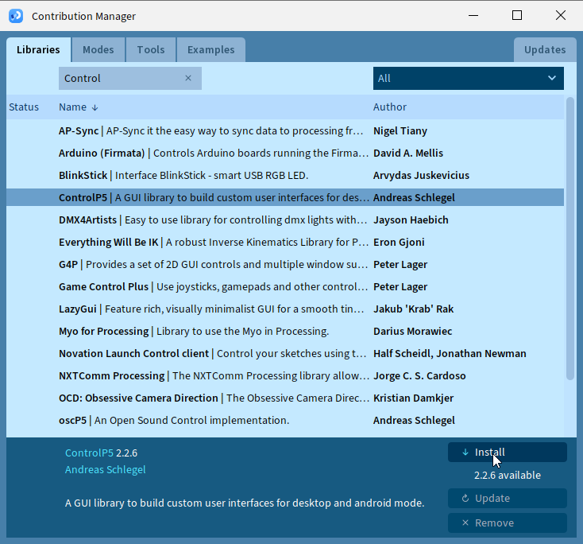
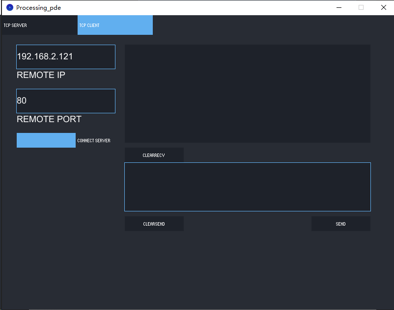
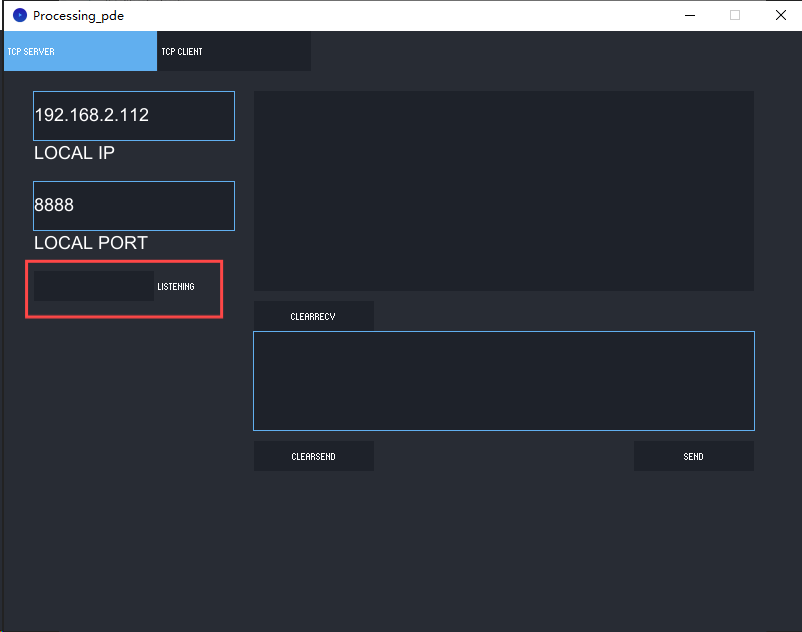

Chapter 21 TCP/IP
=========================
In this chapter, we will introduce how ESP32-S3 implements network communications 
based on TCP/IP protocol. There are two roles in TCP/IP communication, namely 
Server and Client, which will be implemented respectively with two projects in 
this chapter.

Project 21.1 As Client
------------------------
In this section, ESP32-S3 is used as Client to connect Server on the same LAN 
and communicate with it.

**Install Processing** 
In this tutorial, we use Processing to build a simple TCP/IP communication 
platform. If you've not installed Processing, you can download it by clicking 
https://processing.org/download/. You can choose an appropriate version to downl
oad according to your PC system.

Unzip the downloaded file to your computer. Click "processing.exe" as the figure 
below to run this software.

**Use Server mode for communication**

Install ControlP5.

    
Open the “Super_Starter_Kit_for_ESP32_S3\\processing\\Processing_wifi.pde”, and click "Run".

The new pop-up interface is as follows. If ESP32-S3 is used as client, select 
TCP SERVER mode for Processing_wifi

When Processing_wifi selects TCP SERVER mode, ESP32-S3 Sketch needs to be changed 
according to Processing_wifi's displaying of LOCAL IP or LOCAL PORT.

If ESP32-S3 serves as server, select TCP CLIENT mode for Processing_wifi.

When Processing_wifi selects TCP CLIENT mode, the LOCAL IP and LOCAL PORT of Processing_wifi 
need to be changed according to the IP address and port number printed by the serial 
monitor.

Mode selection: select Server mode/Client mode.
IP address: In server mode, this option does not need to be filled in, and the computer will automatically obtain 
the IP address. In client mode, fill in the remote IP address to be connected.

Port number: In server mode, fill in a port number for client devices to make an 
access connection. In client mode, fill in port number given by the Server devices 
to make an access connection.

Start button: In server mode, push the button, then the computer will serve as 
server and open a port number for client to make access connection. During this 
period, the computer will keep monitoring. In client mode, before pushing the 
button, please make sure the server is on, remote IP address and remote port 
number is correct; push the button, and the computer will make access connection 
to the remote port number of the remote IP as a client.

clear receive: clear out the content in the receiving text box 
clear send: clear out the content in the sending text box 
Sending button: push the sending button, the computer will send the content in 
the text box to others.

Connect
^^^^^^^^^^^

.. image:: img/0/connect1.png

Code
^^^^^^^^^^^
Before running the Code, please open “Processing_wifi.pde.” first, and click “Run”.

The newly pop up window will use the computer’s IP address by default and open a 
data monitor port. Click “Listening”。

Move the program folder “Super_Starter_Kit_for_ESP32_S3/Python/Python_C
odes” to disk(D) in advance with the path of “D:/Micropython_Codes”.

Open “Thonny”, click “This computer” >> “D:” >> “Micropython_Codes” >> “21.1_TCP_a
s_Client” and double click “TCP_as_Client.py”.

Before clicking “Run current script”, please modify the name and password of your 
router and fill in the “host” and “port” according to the IP information shown 
in the box below:

**21.1_TCP_as_Client**

.. image:: img/software/21.1.png

Click “Run current script” and in “Shell”, you can see ESP32-S3 automatically 
connects to Processing_wifi.

.. image:: img/software/21.1-1.png

If you don’t click “Listening” for Processing_wifi, ESP32-S3 will fail to connect and 
will print information as follows:

.. image:: img/software/21.1-2.png

ESP32-S3 connects with TCP SERVER, and TCP SERVER receives messages from ESP32S3, 
as shown in the figure below. You can enter any content in TCP SERVER, click 
SEND, and ESP32-S3 will receive this message

.. image:: img/software/21.1-3.png

The following is the program code:

.. code-block:: python

    import network
    import socket
    import time

    ssidRouter     =  "********"       #Enter the router name
    passwordRouter =  "********"       #Enter the router password
    host           =  "192.168.2.112"  #input the remote server
    port           =   8888            #input the remote port

    wlan=None
    s=None

    def connectWifi(ssid,passwd):
    global wlan
    wlan=network.WLAN(network.STA_IF)
    wlan.active(True)
    wlan.disconnect()
    wlan.connect(ssid,passwd)
    while(wlan.ifconfig()[0]=='0.0.0.0'):
        time.sleep(1)
    return True
    try:
    connectWifi(ssidRouter,passwordRouter)
    s = socket.socket()
    s.setsockopt(socket.SOL_SOCKET, socket.SO_REUSEADDR, 1)
    s.connect((host,port))
    print("TCP Connected to:", host, ":", port)
    s.send('Hello')
    s.send('This is my IP.')
    while True:
        data = s.recv(1024)
        if(len(data) == 0):
        print("Close socket")
        s.close()
        break
        print(data)
        ret=s.send(data)
    except:
    print("TCP close, please reset!")
    if (s):
        s.close()
    wlan.disconnect()
    wlan.active(False)

Project 21.2 As Server
------------------------
In this section, ESP32-S3 is used as a server to wait for the connection and 
communication of client on the same LAN.

Circuit
^^^^^^^^^^^^^^^^^
Connect ESP32-S3 to the computer using a USB cable.

Code
^^^^^^^
Move the program folder “Super_Starter_Kit_for_ESP32_S3/Python/Python_C
odes” to disk(D) in advance with the path of “D:/Micropython_Codes”.

Open “Thonny”, click “This computer” >> “D:” >> “Micropython_Codes” >> “21.2_TCP_as_Server” and double click “TCP_as_Server.py”.

Before clicking “Run current script”, please modify the name and password of your 
router shown in the box below.

**21.2_TCP_as_Server**

.. image:: img/software/21.2.png

After making sure that the router’s name and password are correct, click “Run 
current script” and in “Shell”, you can see a server opened by the ESP32-S3 
waiting to connecting to other network devices.

.. image:: img/software/21.2-1.png

Processing： Open the “Super_Starter_Kit_for_ESP32_S3/Codes/MicroPytho
n_Codes/21.2_TCP_as_Server/sketchWiFi/Processing_wifi.pde”. Based on the message 
printed in "Shell", enter the correct IP address and port when processing, and 
click to establish a connection with ESP32-S3 to communicate.

.. image:: img/software/21.2-2.png

You can enter any information in the “Send Box” of Processing_wifi. Click “Send” and 
ESP32-S3 will print the received messages to “Shell” and send them back to 
Processing_wifi.

.. image:: img/software/21.2-3.png

The following is the program code:

.. code-block:: python

    import network
    import socket
    import time

    ssidRouter     =  "********"       #Enter the router name
    passwordRouter =  "********"       #Enter the router password
    port           =   8000            #input the remote port
    wlan=None
    listenSocket=None

    def connectWifi(ssid,passwd):
    global wlan
    wlan=network.WLAN(network.STA_IF)
    wlan.active(True)
    wlan.disconnect()
    wlan.connect(ssid,passwd)
    while(wlan.ifconfig()[0]=='0.0.0.0'):
        time.sleep(1)
    return True
        
    try:
    connectWifi(ssidRouter,passwordRouter)
    ip=wlan.ifconfig()[0]
    listenSocket = socket.socket()
    listenSocket.bind((ip,port))
    listenSocket.listen(1)
    listenSocket.setsockopt(socket.SOL_SOCKET, socket.SO_REUSEADDR, 1)
    print ('tcp waiting...')
    while True:
        print("Server IP:",ip,"\tPort:",port)
        print("accepting.....")
        conn,addr = listenSocket.accept()
        print(addr,"connected")
        break
    conn.send('I am Server')
    while True:
        data = conn.recv(1024)
        if(len(data) == 0):
        print("close socket")
        listenSocket.close()
        wlan.disconnect()
        wlan.active(False)
        break
        else:
        print(data)
        ret = conn.send(data)               
    except:
    print("Close TCP-Server, please reset.")
    if(listenSocket):
        listenSocket.close()
    wlan.disconnect()
    wlan.active(False)

