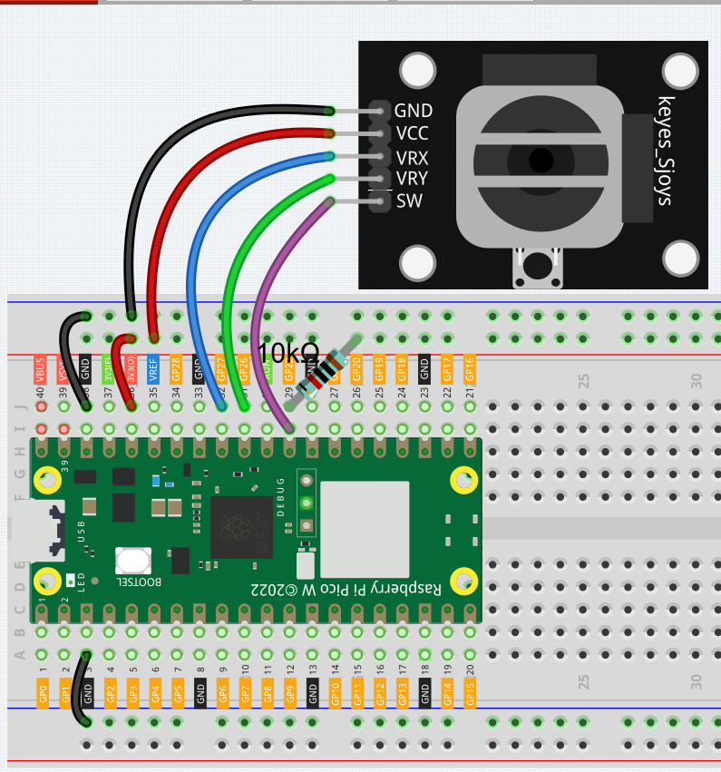
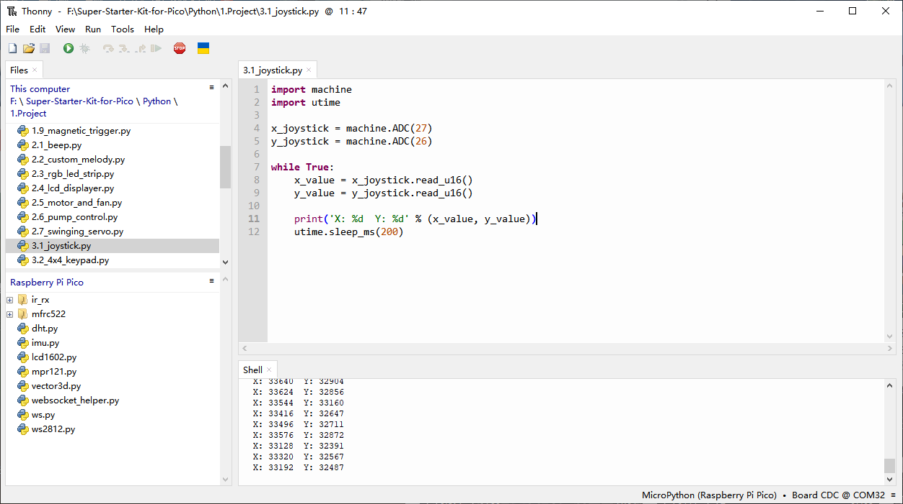
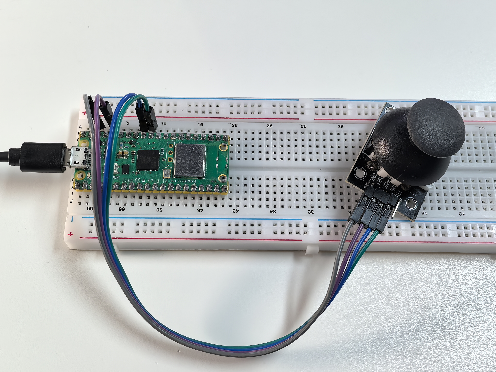

3.1 Joystick
=========================
If you’re an avid gamer, you’re likely very familiar with the joystick. It’s commonly 
used to navigate characters, rotate screens, and perform other in-game actions. The 
way a joystick allows a computer to interpret our movements is actually quite straightforward. 
Essentially, it consists of two potentiometers oriented perpendicular to each other. 
These potentiometers measure the joystick’s position in both the vertical and horizontal 
directions, generating a coordinate value (x, y) within a two-dimensional Cartesian 
coordinate system.

Component List
^^^^^^^^^^^^^^^
- Raspberry Pi Pico W x1
- MicroUSB cable x1
- 830 Tie-Points Breadboard x1
- Joystick Module x1
- Jumper Wire Several

Component knowledge
^^^^^^^^^^^^^^^^^^^^
:ref:`Joystick Module <cpn_joystick>`
""""""""""""""""""""""""""""""""""""""

Connect
^^^^^^^^^

Code
^^^^^^^
.. note::

    * Open the ``3.1_joystick.py`` file under the path of ``Ultimate-Starter-Kit-for-Pico\Python\1.Project`` or copy this code into Thonny, then click "Run Current Script" or simply press F5 to run it.

    * Don't forget to click on the "MicroPython (Raspberry Pi Pico)" interpreter in the bottom right corner. 

Click “Run current script”, the Shell prints out the x,y,z values of joystick.

* The x-axis and y-axis values are analog values that vary from 0 to 65535.

The following is the program code:

.. code-block:: python

    import machine
    import utime

    x_joystick = machine.ADC(27)
    y_joystick = machine.ADC(26)

    while True:
        x_value = x_joystick.read_u16()
        y_value = y_joystick.read_u16()

        print('X: %d  Y: %d' % (x_value, y_value))
        utime.sleep_ms(200)

Phenomenon
^^^^^^^^^^^
