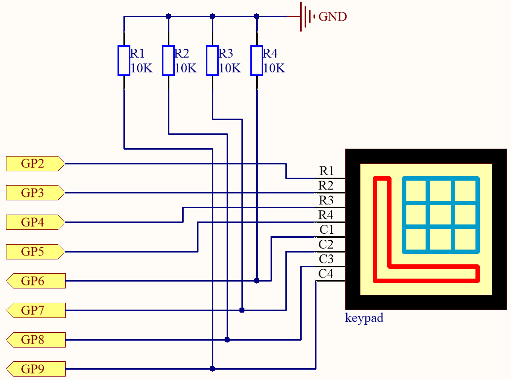
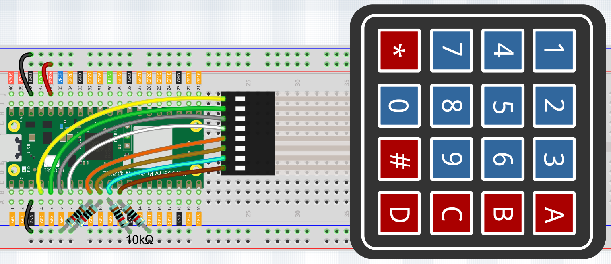
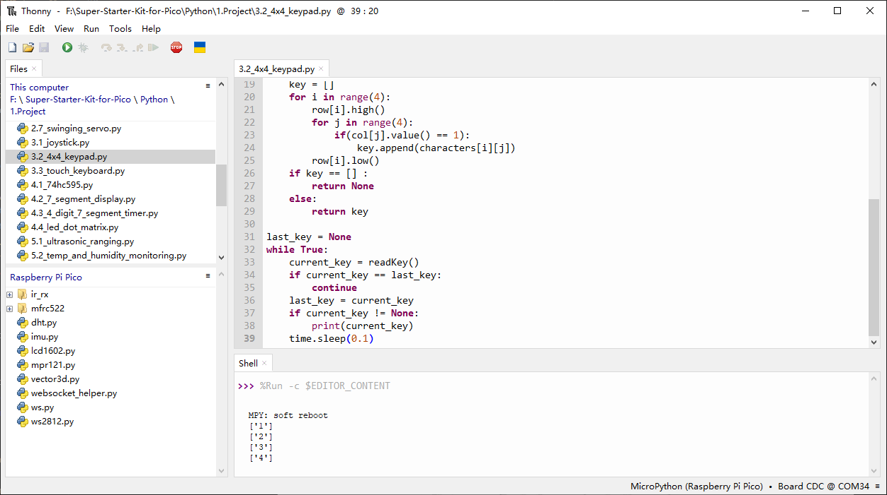
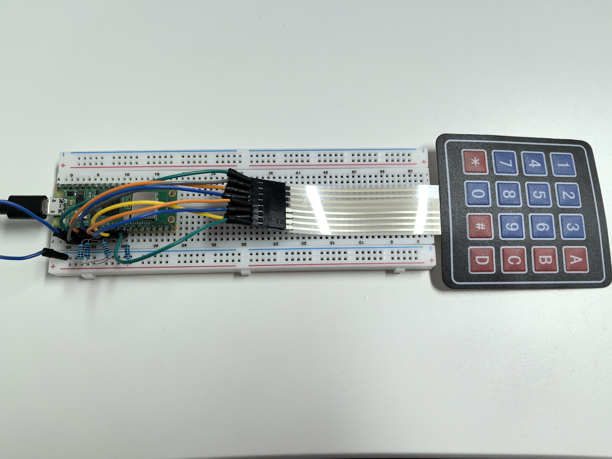

3.2 4x4 Keypad
=========================
The 4x4 keyboard, also known as the matrix keyboard, is a matrix of 16 keys excluded in a single panel.

The keypad can be found on devices that mainly require digital input, such as calculators, TV remote controls, push-button phones, vending machines, ATMs, combination locks, and digital door locks.

In this project, we will learn how to determine which key is pressed and get the related key value.

Component List
^^^^^^^^^^^^^^^
- Raspberry Pi Pico W x1
- MicroUSB cable x1
- 830 Tie-Points Breadboard x1
- Resistor 10KΩ x4
- 4x4 Keypad x1
- Jumper Wire Several

Component knowledge
^^^^^^^^^^^^^^^^^^^^
:ref:`4x4 Keypad <cpn_keypad>`
"""""""""""""""""""""""""""""""""""

Schematic
^^^^^^^^^^

4 pull-down resistors are connected to each of the columns of the matrix keyboard, so that G6 ~ G9 get a stable low level when the keys are not pressed.

The rows of the keyboard (G2 ~ G5) are programmed to go high; if one of G6 ~ G9 is read high, then we know which key is pressed.

For example, if G6 is read high, then numeric key 1 is pressed; this is because the control pins of numeric key 1 are G2 and G6, when numeric key 1 is pressed, G2 and G6 will be connected together and G6 is also high.

Connect
^^^^^^^^^

To make the wiring easier, in the above diagram, the column row of the matrix keyboard and the 10K resistors are inserted into the holes where G6 ~ G9 are located at the same time.

Code
^^^^^^^
.. note::

    * Open the ``3.2_4x4_keypad.py`` file under the path of ``Ultimate-Starter-Kit-for-Pico\Python\1.Project`` or copy this code into Thonny, then click "Run Current Script" or simply press F5 to run it.

    * Don't forget to click on the "MicroPython (Raspberry Pi Pico)" interpreter in the bottom right corner. 

Click “Run current script”, the Shell will print out the keys you pressed on the Keypad.

The following is the program code:

.. code-block:: python

    import machine
    import time

    characters = [["1","2","3","A"],["4","5","6","B"],["7","8","9","C"],["*","0","#","D"]]

    pin = [2,3,4,5]
    row = []
    for i in range(4):
        row.append(None)
        row[i] = machine.Pin(pin[i], machine.Pin.OUT)

    pin = [6,7,8,9]
    col = []
    for i in range(4):
        col.append(None)
        col[i] = machine.Pin(pin[i], machine.Pin.IN)

    def readKey():
        key = []
        for i in range(4):
            row[i].high()
            for j in range(4):
                if(col[j].value() == 1):
                    key.append(characters[i][j])
            row[i].low()
        if key == [] :
            return None
        else:
            return key

    last_key = None
    while True:
        current_key = readKey()
        if current_key == last_key:
            continue
        last_key = current_key
        if current_key != None:
            print(current_key)
        time.sleep(0.1)

Phenomenon
^^^^^^^^^^^
