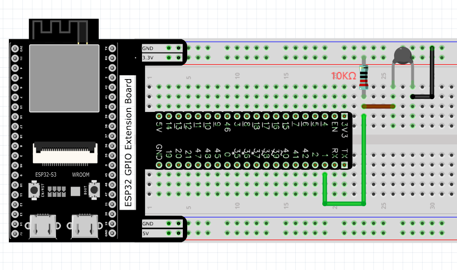
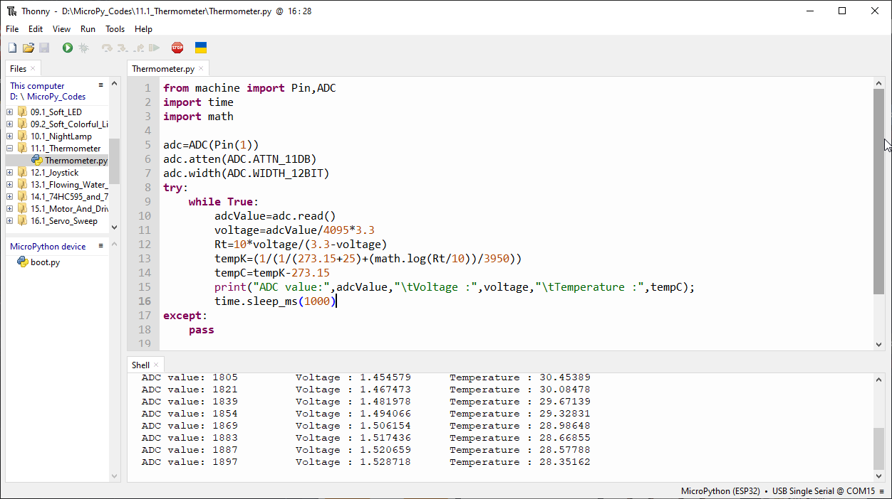
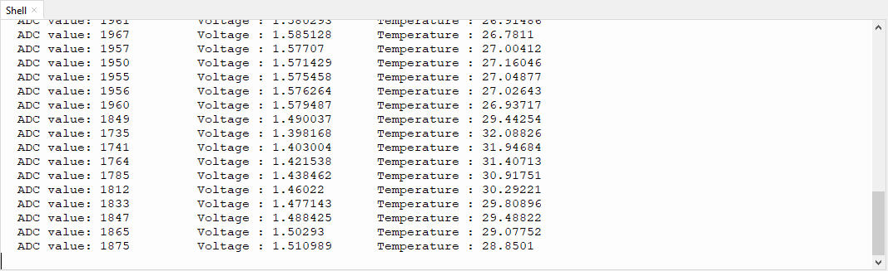

Chapter 11 Thermistor
=========================
In this chapter, we will learn about thermistors which are another kind of resistor

Project 11.1 Thermometer
------------------------
A thermistor is a type of resistor whose resistance value is dependent on temperature 
and changes in temperature. Therefore, we can take advantage of this characteristic 
to make a thermometer.

Component List
^^^^^^^^^^^^^^^
- ESP32-S3-WROOM x1
- GPIO Extension Board x1
- 830 Tie-Points Breadboard x1
- Resistor 10kΩ  x1
- Thermistor x1
- Jumper Wire x3

Component knowledge
^^^^^^^^^^^^^^^^^^^^
:ref:`Thermistor <component_thermistor>`
"""""""""""""""""""""""""""""""""""""""""

Connect
^^^^^^^^
The circuit of this project is similar to the one in the last chapter. The only 
difference is that the photoresistor is replaced by the thermistor.

Code
^^^^^^^
Move the program folder “Super_Starter_Kit_for_ESP32_S3/Python/Python_C
odes” to disk(D) in advance with the path of “D:/Micropython_Codes”. 
Open “Thonny”, click “This computer” >> “D:” >> “Micropython_Codes” >> “11.1_Thermo
meter” and double click “Thermometer.py”.

**11.1_Thermometer**

Click “Run current script” and “Shell” will constantly display the current ADC 
value, voltage value and temperature value. Try to “pinch” the thermistor (witho
ut touching the leads) with your index finger and thumb for a brief time, you sh
ould see that the temperature value increases.

The following is the program code:

.. code-block:: python

    from machine import Pin,ADC
    import time
    import math

    adc=ADC(Pin(1))
    adc.atten(ADC.ATTN_11DB)
    adc.width(ADC.WIDTH_12BIT)
    try:
        while True:
            adcValue=adc.read()
            voltage=adcValue/4095*3.3
            Rt=10*voltage/(3.3-voltage)
            tempK=(1/(1/(273.15+25)+(math.log(Rt/10))/3950))
            tempC=tempK-273.15
            print("ADC value:",adcValue,"\tVoltage :",voltage,"\tTemperature :",tempC);
            time.sleep_ms(1000)
    except:
        pass

