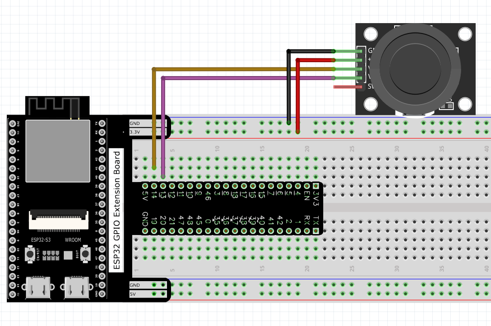
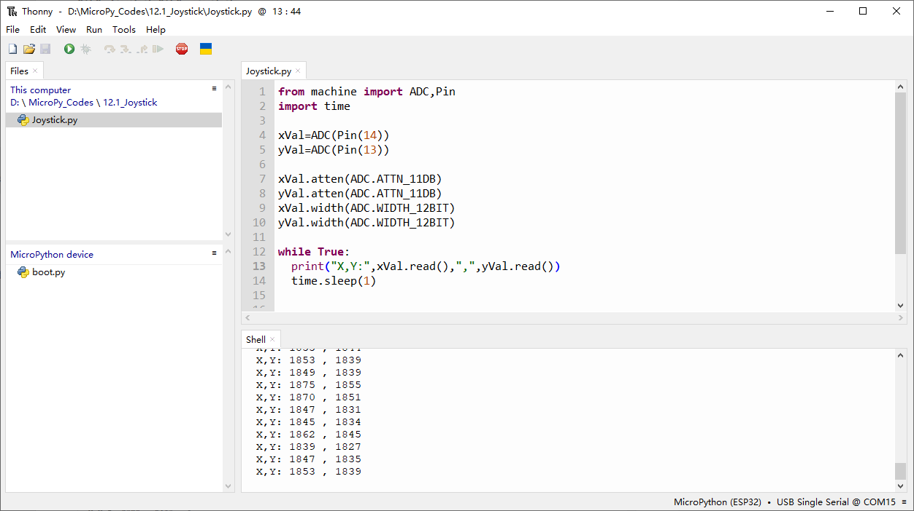
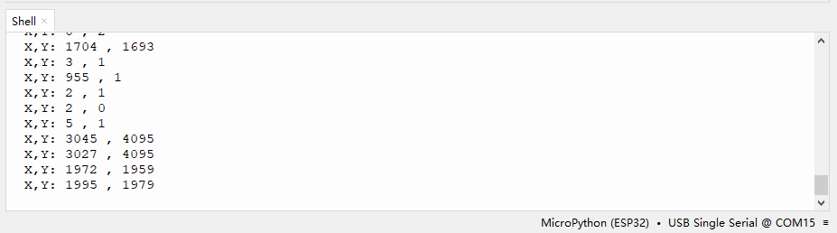

Chapter 12 Joystick
=========================
In the previous chapter, we have learned how to use rotary potentiometer. Now, 
let's learn a new electronic module joystick which working on the same principle 
as rotary potentiometer.

Project 12.1 Joystick
--------------------------
In this project, we will read the output data of a joystick and display it to the 
Terminal screen.

Component List
^^^^^^^^^^^^^^^
- ESP32-S3-WROOM x1
- GPIO Extension Board x1
- 830 Tie-Points Breadboard x1
- Joystick x1
- Jumper Wire x5

Component knowledge
^^^^^^^^^^^^^^^^^^^^
:ref:`Joystick <cpn_joystick>`

Connect
^^^^^^^^^

Code
^^^^^^^
In this project’s code, we will read the ADC values of X and Y axes of the Joyst
ick, and read digital quality of the Z axis, then display these out in Terminal. 
Move the program folder “Super_Starter_Kit_for_ESP32_S3/Python/Python_C
odes” to disk(D) in advance with the path of “D:/Micropython_Codes”.
Open “Thonny”, click “This computer” >> “D:” >> “Micropython_Codes” >> “12.1_Joysti
ck” and double click “Joystick.py”.

**12.1_Joystick**

Click “Run current script”. Shifting the Joystick or pressing it down will make 
the printed data in “Shell” change.

The following is the program code:

.. code-block:: python
    
    from machine import ADC,Pin
    import time

    xVal=ADC(Pin(14))
    yVal=ADC(Pin(13))

    xVal.atten(ADC.ATTN_11DB)
    yVal.atten(ADC.ATTN_11DB)
    xVal.width(ADC.WIDTH_12BIT)
    yVal.width(ADC.WIDTH_12BIT)

    while True:
    print("X,Y:",xVal.read(),",",yVal.read())
    time.sleep(1)

    
    
    
    
    

  
  
  
  
  
