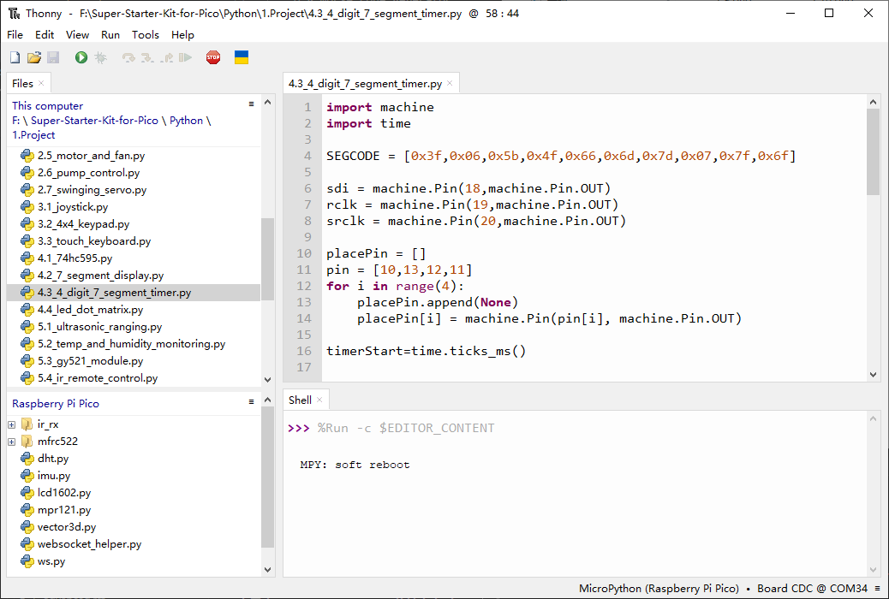

4.3 4 Digit 7 Segment Timer
================================
4-digit 7-segment display consists of four 7-segment displays working together.

The 4-digtal 7-segment display works independently. It uses the principle of human visual persistence to quickly display the characters of each 7-segment in a loop to form continuous strings.

For example, when “1234” is displayed on the display, “1” is displayed on the first 7-segment, and “234” is not displayed. After a period of time, the second 7-segment shows “2”, the 1st 3th 4th of 7-segment does not show, and so on, the four digital display show in turn. This process is very short (typically 5ms), and because of the optical afterglow effect and the principle of visual residue, we can see four characters at the same time.

Component List
^^^^^^^^^^^^^^^
- Raspberry Pi Pico W x1
- MicroUSB cable x1
- 830 Tie-Points Breadboard x1
- 4-Digit 7-Segment Display x1
- Resistor 220Ω x4
- 74HC595 x1
- Jumper Wire Several

Component knowledge
^^^^^^^^^^^^^^^^^^^^

:ref:`transistor <cpn_transistor>`
"""""""""""""""""""""""""""""""""""

:ref:`Buzzer <cpn_buzzer>`
"""""""""""""""""""""""""""

Schematic
^^^^^^^^^^

Here the wiring principle is basically the same as 4.1 74HC595, the only difference is that Q0-Q7 are connected to the a ~ g pins of the 4-digit 7-segment display.

Then G10 ~ G13 will select which 7-segment display to work.

Connect
^^^^^^^^^

Code
^^^^^^^
.. note::

    * Open the ``4.3_4_digit_7_segment_timer.py`` file under the path of ``Ultimate-Starter-Kit-for-Pico\Python\1.Project`` or copy this code into Thonny, then click "Run Current Script" or simply press F5 to run it.

    * Don't forget to click on the "MicroPython (Raspberry Pi Pico)" interpreter in the bottom right corner. 

Click “Run current script”, you will see the 4-digit 7-segment display become a counter and the number increases by 1 per second.

The following is the program code:

.. code-block:: python

    import machine
    import time

    SEGCODE = [0x3f,0x06,0x5b,0x4f,0x66,0x6d,0x7d,0x07,0x7f,0x6f]

    sdi = machine.Pin(18,machine.Pin.OUT)
    rclk = machine.Pin(19,machine.Pin.OUT)
    srclk = machine.Pin(20,machine.Pin.OUT)

    placePin = []
    pin = [10,13,12,11]
    for i in range(4):
        placePin.append(None)
        placePin[i] = machine.Pin(pin[i], machine.Pin.OUT)

    timerStart=time.ticks_ms()

    def timer1():
        return int((time.ticks_ms()-timerStart)/1000)

    def pickDigit(digit):
        for i in range(4):
            placePin[i].value(1)
        placePin[digit].value(0)

    def clearDisplay():
        hc595_shift(0x00)

    def hc595_shift(dat):
        rclk.low()
        time.sleep_us(200)
        for bit in range(7, -1, -1):
            srclk.low()
            time.sleep_us(200)
            value = 1 & (dat >> bit)
            sdi.value(value)
            time.sleep_us(200)
            srclk.high()
            time.sleep_us(200)
        time.sleep_us(200)
        rclk.high()
        time.sleep_us(200)

    while True:
        count = timer1()
        #print(count)

        pickDigit(0)
        hc595_shift(SEGCODE[count%10])

        pickDigit(1)
        hc595_shift(SEGCODE[count%100//10])

        pickDigit(2)
        hc595_shift(SEGCODE[count%1000//100])

        pickDigit(3)
        hc595_shift(SEGCODE[count%10000//1000])

Phenomenon
^^^^^^^^^^^
.. video:: img/5.phenomenon/4.3.mp4
    :width: 100%