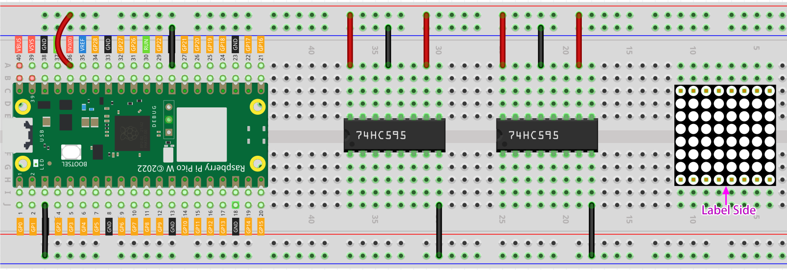
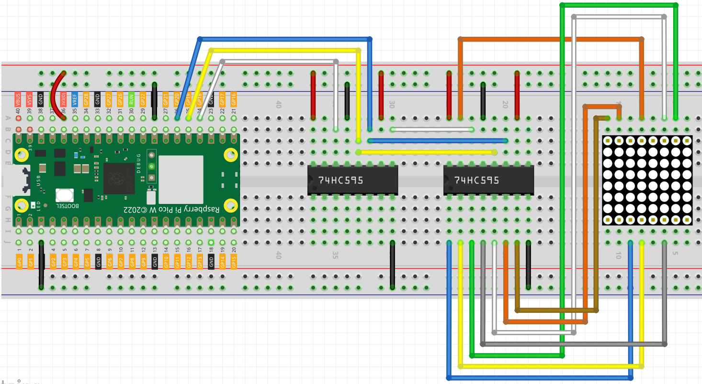
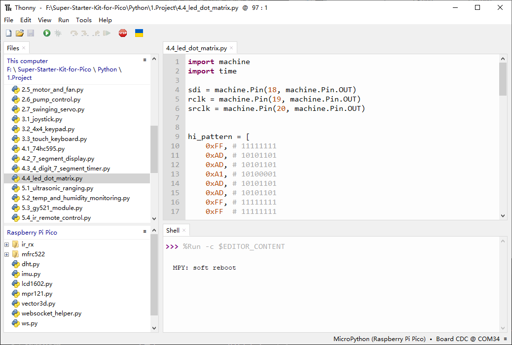

4.4 LED Dot Matrix
=========================
LED matrix is a low-resolution dot-matrix display. it uses an array of light-emitting diodes as pixels for patterned displays.

They are bright enough to be visible in outdoor sunlight, and you can see them on some stores, billboards, signs, and variable message displays (such as those on public transit vehicles).

Used in this kit is an 8x8 dot matrix with 16 pins. Their anodes are connected in rows and their cathodes are connected in columns (at the circuit level), which together control these 64 LEDs.

To light the first LED, you should provide a high level for Row1 and a low level for Col1. To light the second LED, it should provide a high level for Row1, a low level for Col2, and so on. By controlling the current through each pair of rows and columns, each LED can be controlled individually to display characters or pictures.

Component List
^^^^^^^^^^^^^^^
- Raspberry Pi Pico W x1
- MicroUSB cable x1
- 830 Tie-Points Breadboard x1
- LED Dot Matrix x1
- 74HC595 x2
- Jumper Wire Several

Component knowledge
^^^^^^^^^^^^^^^^^^^^

:ref:`transistor <cpn_transistor>`
"""""""""""""""""""""""""""""""""""

:ref:`Buzzer <cpn_buzzer>`
"""""""""""""""""""""""""""

Schematic
^^^^^^^^^^

The 8x8 dot matrix is controlled by two 74HC595 chips, one controlling the rows and one controlling the columns, while these two chips share G18~G20, which can greatly save the I/O ports of the Pico W board.

Pico W needs to output a 16-bit binary number at a time, the first 8 bits are given to the 74HC595 which controls the rows, and the last 8 bits are given to the 75HC595 which controls the columns, so that the dot matrix can display a specific pattern.

Q7’: Series output pin, connected to DS of another 74HC595 to connect multiple 74HC595s in series.

Connect
^^^^^^^^^
Build the circuit. Since the wiring is complicated, let’s make it step by step.

Step 1: First, insert the Pico W, the LED dot matrix and two 74HC595 chips into breadboard. Connect the 3.3V and GND of the Pico W to holes on the two sides of the board, then hook up pin16 and 10 of the two 74HC595 chips to VCC, pin 13 and pin 8 to GND.

Step 2: Connect pin 11 of the two 74HC595 together, and then to GP20; then pin 12 of the two chips, and to GP19; next, pin 14 of the 74HC595 on the left side to GP18 and pin 9 to pin 14 of the second 74HC595.

Step 3: The 74HC595 on the right side is to control columns of the LED dot matrix. See the table below for the mapping. Therefore, Q0-Q7 pins of the 74HC595 are mapped with pin 13, 3, 4, 10, 6, 11, 15, and 16 respectively.

Step 4: Now connect the ROWs of the LED dot matrix. The 74HC595 on the left controls ROW of the LED dot matrix. See the table below for the mapping. We can see, Q0-Q7 of the 74HC595 on the left are mapped with pin 9, 14, 8, 12, 1, 7, 2, and 5 respectively.

Code
^^^^^^^
.. note::

    * Open the ``4.4_led_dot_matrix.py`` file under the path of ``Super-Starter-Kit-for-Pico\Python\1.Project`` or copy this code into Thonny, then click "Run Current Script" or simply press F5 to run it.

    * Don't forget to click on the "MicroPython (Raspberry Pi Pico)" interpreter in the bottom right corner. 

Click “Run current script”, you will see a x graphic displayed on the 8x8 dot matrix.

The following is the program code:

.. code-block:: python

    import machine
    import time

    sdi = machine.Pin(18,machine.Pin.OUT)
    rclk = machine.Pin(19,machine.Pin.OUT)
    srclk = machine.Pin(20,machine.Pin.OUT)

    glyph = [0xFF,0xBB,0xD7,0xEF,0xD7,0xBB,0xFF,0xFF]

    # Shift the data to 74HC595
    def hc595_in(dat):
        for bit in range(7,-1, -1):
            srclk.low()
            time.sleep_us(30)
            sdi.value(1 & (dat >> bit))
            time.sleep_us(30)
            srclk.high()

    def hc595_out():
        rclk.high()
        time.sleep_us(200)
        rclk.low()

    while True:
        for i in range(0,8):
            hc595_in(glyph[i])
            hc595_in(0x80>>i)
            hc595_out()

Phenomenon
^^^^^^^^^^^
.. image:: img/5.phenomenon/4.4.mp4
    :width: 100%