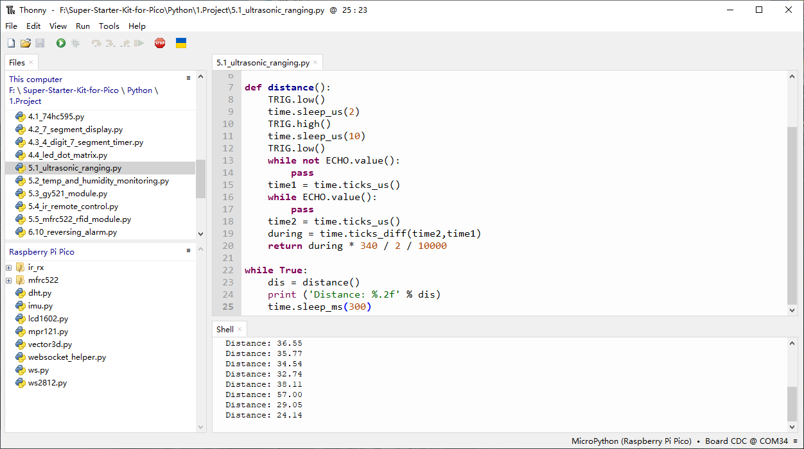

5.1 Ultrasonic Ranging
=========================
The ultrasonic sensor module operates based on the principles of sonar and radar to measure the distance to an object.

Component List
^^^^^^^^^^^^^^^
- Raspberry Pi Pico W x1
- MicroUSB cable x1
- 830 Tie-Points Breadboard x1
- Ultrasonic Module x1
- Jumper Wire Several

Component knowledge
^^^^^^^^^^^^^^^^^^^^
:ref:`Ultrasonic Module <cpn_ultrasonic_module>`
""""""""""""""""""""""""""""""""""""""""""""""""""

Schematic
^^^^^^^^^^
.. image:: img/2.sch/5.1.png

Connect
^^^^^^^^^

Code
^^^^^^^
.. note::

    * Open the ``5.1_ultrasonic_ranging.py`` file under the path of ``Ultimate-Starter-Kit-for-Pico\Python\1.Project`` or copy this code into Thonny, then click "Run Current Script" or simply press F5 to run it.

    * Don't forget to click on the "MicroPython (Raspberry Pi Pico)" interpreter in the bottom right corner. 

Click “Run current script”, the Shell will print out the distance of the ultrasonic sensor from the obstacle ahead.

The following is the program code:

.. code-block:: python

    import machine
    import time

    TRIG = machine.Pin(17,machine.Pin.OUT)
    ECHO = machine.Pin(16,machine.Pin.IN)

    def distance():
        TRIG.low()
        time.sleep_us(2)
        TRIG.high()
        time.sleep_us(10)
        TRIG.low()
        while not ECHO.value():
            pass
        time1 = time.ticks_us()
        while ECHO.value():
            pass
        time2 = time.ticks_us()
        during = time.ticks_diff(time2,time1)
        return during * 340 / 2 / 10000

    while True:
        dis = distance()
        print ('Distance: %.2f' % dis)
        time.sleep_ms(300)

Phenomenon
^^^^^^^^^^^
.. image:: img/5.phenomenon/5.1.png
    :width: 100%