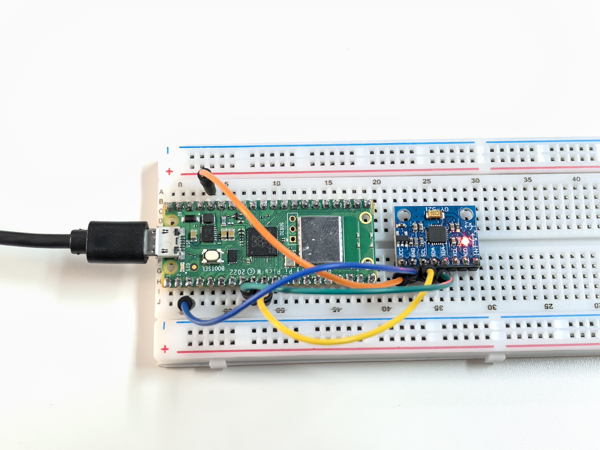

5.3 GY521 Module
=========================
The GY-521 module is a compact six-axis motion tracking sensor that combines a 3-axis 
gyroscope and a 3-axis accelerometer. It is built around the MPU-6050 chip, a sensor 
designed for mobile devices such as smartphones, tablets, and wearables. The GY-521 
inherits the MPU-6050's low power consumption, low cost, and high performance, making 
it suitable for applications that require precise dynamic capture and motion analysis. 
It is widely used in robotics, gaming controllers, motion tracking systems, and other 
applications needing accurate movement data. With its I²C interface, the GY-521 can easily 
integrate with various microcontrollers and processors, offering a versatile and powerful 
solution for developers.

In this experiment, we will use the I²C interface to retrieve data from the GY-521's 
three-axis accelerometer and three-axis gyroscope and display these values on a screen.

Component List
^^^^^^^^^^^^^^^
- Raspberry Pi Pico W x1
- MicroUSB cable x1
- 830 Tie-Points Breadboard x1
- MPU6050 Module
- Jumper Wire Several

Component knowledge
^^^^^^^^^^^^^^^^^^^^

:ref:`MPU6050 Module <cpn_mpu6050_module>`
"""""""""""""""""""""""""""""""""""""""""""

Schematic
^^^^^^^^^^

Connect
^^^^^^^^^

Code
^^^^^^^
.. note::

    * Open the ``5.3_gy521_module.py`` file under the path of ``Ultimate-Starter-Kit-for-Pico\Python\1.Project`` or copy this code into Thonny, then click "Run Current Script" or simply press F5 to run it.

    * Don't forget to click on the "MicroPython (Raspberry Pi Pico)" interpreter in the bottom right corner. 

Click “Run current script”, you can see the 3-axis accelerometer values and 3-axis gyroscope values cycling through the output. At this point you rotate the MPU6050 at random, and these values will appear to change accordingly. To make it easier to see the changes, you can comment out one of the print lines and concentrate on another set of data.

The unit of acceleration value is m/s², and the unit of gyroscope value is °/s.

The following is the program code:

.. code-block:: python

    from imu import MPU6050
    from machine import I2C, Pin
    import time

    i2c = I2C(1, sda=Pin(6), scl=Pin(7), freq=400000)
    mpu = MPU6050(i2c)

    while True:
        print("x: %s, y: %s, z: %s"%(mpu.accel.x, mpu.accel.y, mpu.accel.z))
        time.sleep(0.5)
        print("A: %s, B: %s, Y: %s"%(mpu.gyro.x, mpu.gyro.y, mpu.gyro.z))
        time.sleep(0.5)

Phenomenon
^^^^^^^^^^^
