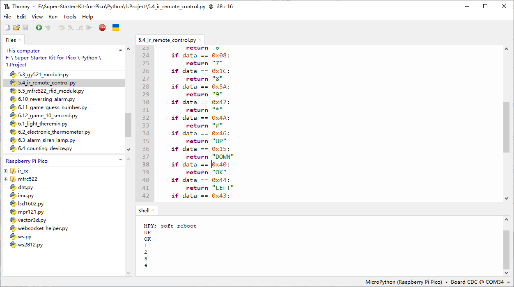

5.4 IR Remote Control
=========================
In consumer electronics, remote controls are used to operate devices such as televisions and DVD players. In some cases, remote controls allow people to operate devices that are out of their reach, such as central air conditioners.

IR Receiver is a component with photocell that is tuned to receive to infrared light. It is almost always used for remote control detection - every TV and DVD player has one of these in the front to receive for the IR signal from the clicker. Inside the remote control is a matching IR LED, which emits IR pulses to tell the TV to turn on, off or change channels.

Component List
^^^^^^^^^^^^^^^
- Raspberry Pi Pico W x1
- MicroUSB cable x1
- 830 Tie-Points Breadboard x1
- Infrared Receiver x1
- Jumper Wire Several

Component knowledge
^^^^^^^^^^^^^^^^^^^^

:ref:`transistor <cpn_transistor>`
"""""""""""""""""""""""""""""""""""

:ref:`Buzzer <cpn_buzzer>`
"""""""""""""""""""""""""""

Schematic
^^^^^^^^^^
.. image:: img/2.sch/5.4.png

Connect
^^^^^^^^^
.. image:: img/3.connect/5.4.png

Code
^^^^^^^
.. note::

    * Open the ``5.4_ir_remote_control.py`` file under the path of ``Super-Starter-Kit-for-Pico\Python\1.Project`` or copy this code into Thonny, then click "Run Current Script" or simply press F5 to run it.

    * Don't forget to click on the "MicroPython (Raspberry Pi Pico)" interpreter in the bottom right corner. 

The new remote control has a plastic piece at the end to isolate the battery inside. You need to pull out this plastic piece to power up the remote when you are using it. Once the program is running, when you press the remote control, the Shell will print out the key you pressed.

The following is the program code:

.. code-block:: python

    import time
    from machine import Pin, freq
    from ir_rx.print_error import print_error
    from ir_rx.nec import NEC_8

    pin_ir = Pin(17, Pin.IN)

    def decodeKeyValue(data):
        if data == 0x16:
            return "0"
        if data == 0x0C:
            return "1"
        if data == 0x18:
            return "2"
        if data == 0x5E:
            return "3"
        if data == 0x08:
            return "4"
        if data == 0x1C:
            return "5"
        if data == 0x5A:
            return "6"
        if data == 0x42:
            return "7"
        if data == 0x52:
            return "8"
        if data == 0x4A:
            return "9"
        if data == 0x09:
            return "+"
        if data == 0x15:
            return "-"
        if data == 0x7:
            return "EQ"
        if data == 0x0D:
            return "U/SD"
        if data == 0x19:
            return "CYCLE"
        if data == 0x44:
            return "PLAY/PAUSE"
        if data == 0x43:
            return "FORWARD"
        if data == 0x40:
            return "BACKWARD"
        if data == 0x45:
            return "POWER"
        if data == 0x47:
            return "MUTE"
        if data == 0x46:
            return "MODE"
        return "ERROR"

    # User callback
    def callback(data, addr, ctrl):
        if data < 0:  # NEC protocol sends repeat codes.
            pass
        else:
            print(decodeKeyValue(data))

    ir = NEC_8(pin_ir, callback)  # Instantiate receiver
    ir.error_function(print_error)  # Show debug information

    try:
        while True:
            pass
    except KeyboardInterrupt:
        ir.close()

Phenomenon
^^^^^^^^^^^
.. image:: img/5.phenomenon/5.4.mp4
    :width: 100%