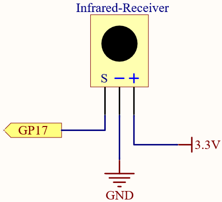
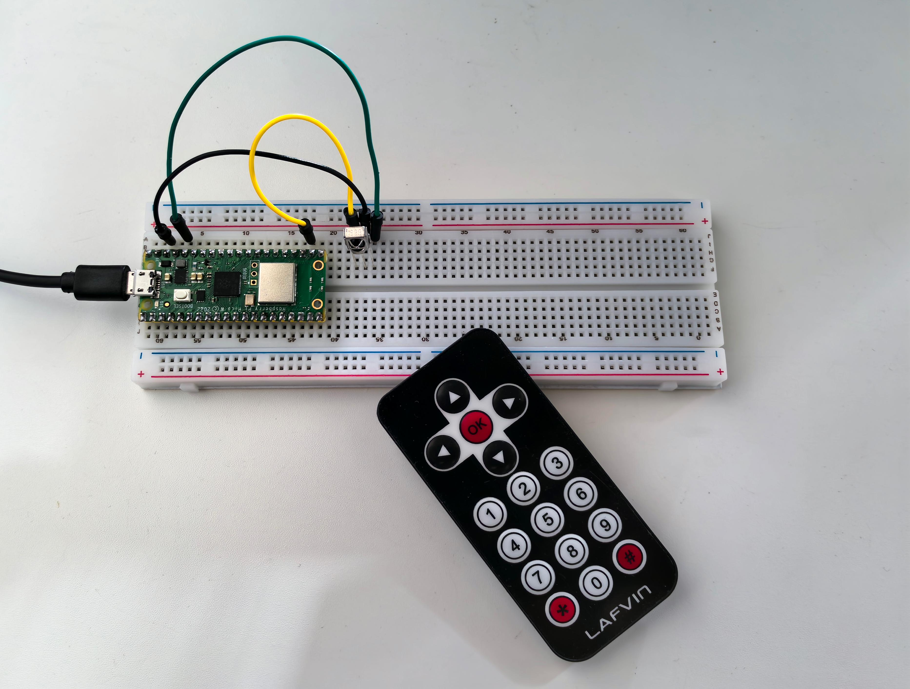

5.4 IR Remote Control
=========================
In consumer electronics, remote controls are commonly used to operate devices like 
televisions and DVD players. They also enable users to control devices that are out 
of reach, such as central air conditioning systems.

An IR Receiver is a component equipped with a photocell that is specifically designed 
to detect infrared light. It is typically used for remote control detection—almost 
every TV and DVD player has an IR Receiver on the front to capture the IR signals 
from the remote. Inside the remote control, there is a matching IR LED that emits 
infrared pulses to instruct the TV to turn on, off, or change channels.

Component List
^^^^^^^^^^^^^^^
- Raspberry Pi Pico W x1
- MicroUSB cable x1
- 830 Tie-Points Breadboard x1
- Infrared Receiver x1
- Jumper Wire Several

Component knowledge
^^^^^^^^^^^^^^^^^^^^

:ref:`Infrared Receiver <cpn_infrared_receiver>`
"""""""""""""""""""""""""""""""""""""""""""""""""""

Schematic
^^^^^^^^^^

Connect
^^^^^^^^^

Code
^^^^^^^
.. note::

    * Open the ``5.4_ir_remote_control.py`` file under the path of ``Ultimate-Starter-Kit-for-Pico\Python\1.Project`` or copy this code into Thonny, then click "Run Current Script" or simply press F5 to run it.

    * Don't forget to click on the "MicroPython (Raspberry Pi Pico)" interpreter in the bottom right corner. 

.. image:: img/4.software/5.4.png

The new remote control has a plastic piece at the end to isolate the battery inside. You need to pull out this plastic piece to power up the remote when you are using it. Once the program is running, when you press the remote control, the Shell will print out the key you pressed.

The following is the program code:

.. code-block:: python

    import time
    from machine import Pin, freq
    from ir_rx.print_error import print_error
    from ir_rx.nec import NEC_8

    pin_ir = Pin(17, Pin.IN)

    def decodeKeyValue(data):
        if data == 0x52:
            return "0"
        if data == 0x16:
            return "1"
        if data == 0x19:
            return "2"
        if data == 0x0D:
            return "3"
        if data == 0x0C:
            return "4"
        if data == 0x18:
            return "5"
        if data == 0x5E:
            return "6"
        if data == 0x08:
            return "7"
        if data == 0x1C:
            return "8"
        if data == 0x5A:
            return "9"
        if data == 0x42:
            return "*"
        if data == 0x4A:
            return "#"
        if data == 0x46:
            return "UP"
        if data == 0x15:
            return "DOWN"
        if data == 0x40:
            return "OK"
        if data == 0x44:
            return "LEFT"
        if data == 0x43:
            return "RIGHT"
        return "ERROR"

    # User callback
    def callback(data, addr, ctrl):
        if data < 0:  # NEC protocol sends repeat codes.
            pass
        else:
            print(decodeKeyValue(data))

    ir = NEC_8(pin_ir, callback)  # Instantiate receiver
    ir.error_function(print_error)  # Show debug information

    try:
        while True:
            pass
    except KeyboardInterrupt:
        ir.close()

Phenomenon
^^^^^^^^^^^
