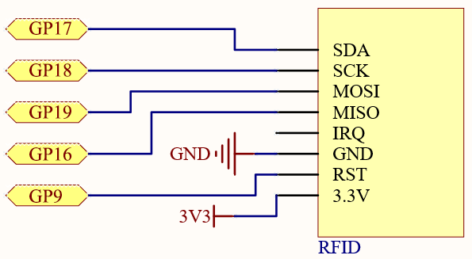
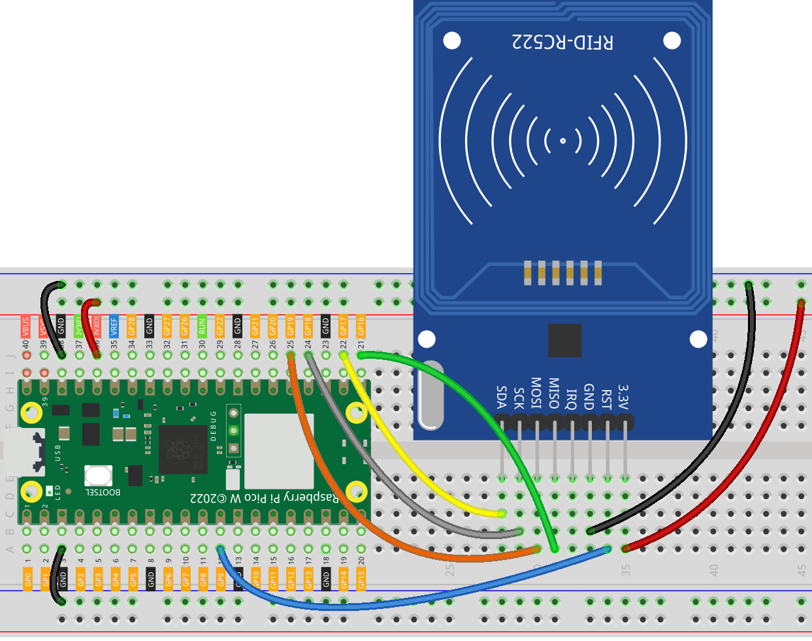
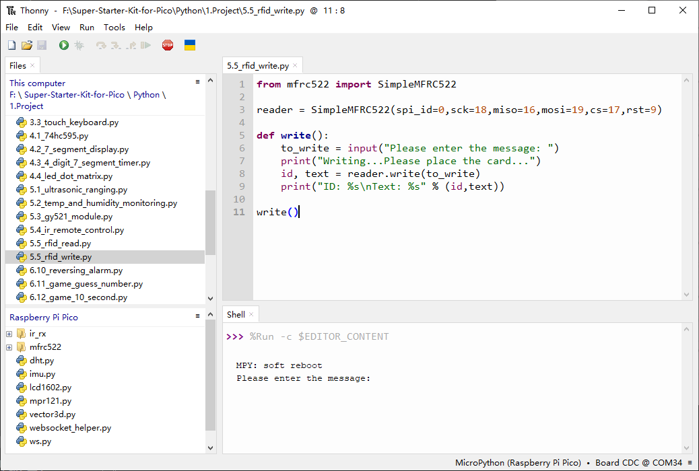
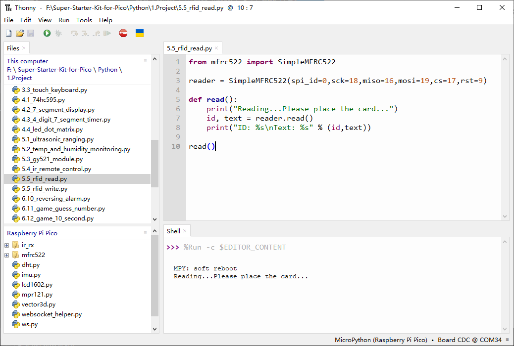

5.5 MFRC522 RFID Module
=========================
Radio Frequency Identification (RFID) is a technology that enables wireless communication 
between an object (or tag) and a reader device to track and identify items. The tag's 
communication range is typically limited to a few meters, and it does not always 
require a direct line of sight between the reader and the tag.

Most RFID tags consist of an integrated circuit (IC) and an antenna. The IC stores 
information and manages communication with the reader through radio frequency (RF) 
signals. Passive tags do not have their own power source and instead draw energy 
from the electromagnetic field generated by the reader. In contrast, active tags 
are powered by an independent energy source, such as a battery, which allows them 
to have enhanced processing capabilities, longer transmission ranges, and stronger 
signal strength.

Component List
^^^^^^^^^^^^^^^
- Raspberry Pi Pico W x1
- MicroUSB cable x1
- 830 Tie-Points Breadboard x1
- MFRC522 Module x1
- Jumper Wire Several

Component knowledge
^^^^^^^^^^^^^^^^^^^^
:ref:`MFRC522 Module <cpn_mfrc522_module>`
"""""""""""""""""""""""""""""""""""""""""""

Schematic
^^^^^^^^^^

Connect
^^^^^^^^^

Code
^^^^^^^
.. note::

    * Open the ``5.5_rfid_write.py and 5.5_rfid_read.py`` file under the path of ``Ultimate-Starter-Kit-for-Pico\Python\1.Project`` or copy this code into Thonny, then click "Run Current Script" or simply press F5 to run it.

    * Don't forget to click on the "MicroPython (Raspberry Pi Pico)" interpreter in the bottom right corner. 
    
    * Please ensure that the libraries in the mfrc522 folder have been uploaded to the Pico W. You can refer to the details in the "Uploading Library Files" section of the Python Preparation guide for more information.

The main function is divided into two:

5.5_rfid_write.py: Used to write information to the card (or key).

After running you will be able to type message in the shell and then put the card (or key) close to the MFRC522 module to write the message in.

.. code-block:: python

    from mfrc522 import SimpleMFRC522

    reader = SimpleMFRC522(spi_id=0,sck=18,miso=16,mosi=19,cs=17,rst=9)

    def write():
        to_write = input("Please enter the message: ")
        print("Writing...Please place the card...")
        id, text = reader.write(to_write)
        print("ID: %s\nText: %s" % (id,text))

    write()

5.5_rfid_read.py: used to read the information in the card (or key)

After running, you will be able to read the message stored in the card (or key).

.. code-block:: python

    from mfrc522 import SimpleMFRC522

    reader = SimpleMFRC522(spi_id=0,sck=18,miso=16,mosi=19,cs=17,rst=9)

    def read():
        print("Reading...Please place the card...")
        id, text = reader.read()
        print("ID: %s\nText: %s" % (id,text))

    read()

Phenomenon
^^^^^^^^^^^
.. image:: img/5.phenomenon/5.5.png
    :width: 100%