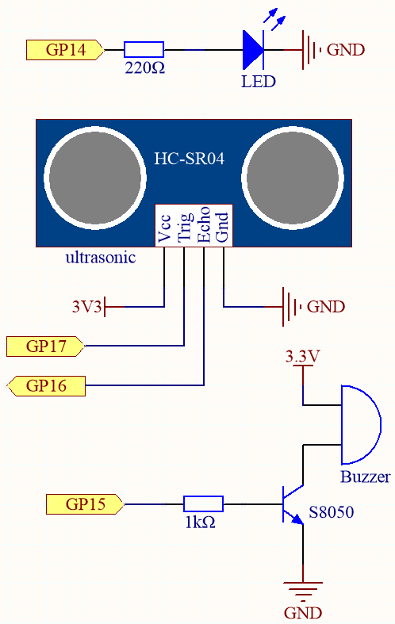
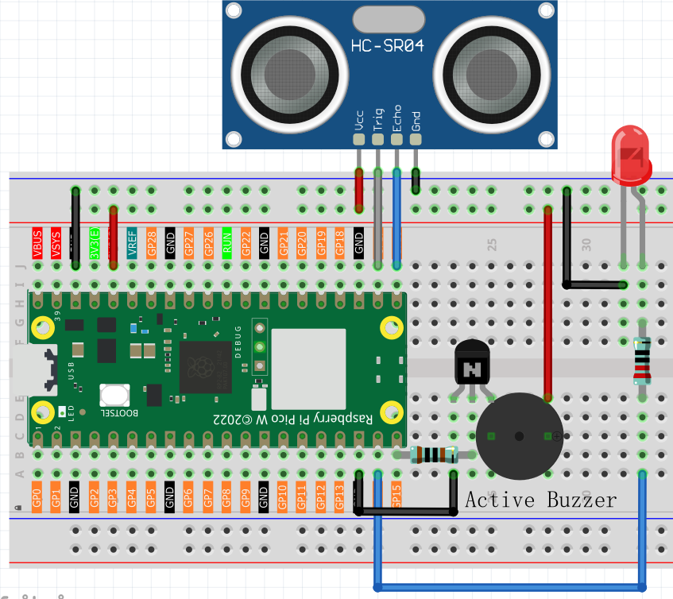
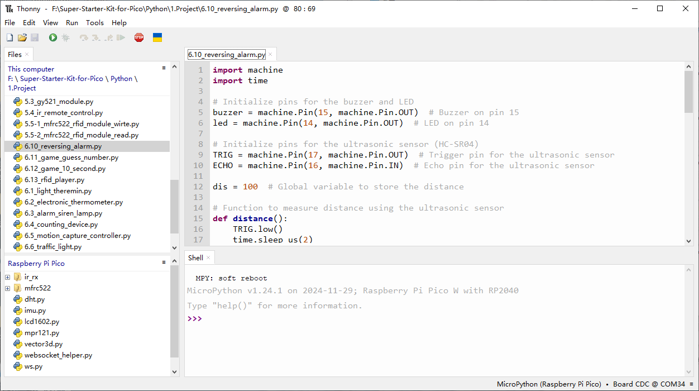

6.10 Reversing Alarm
=========================
This project uses an LED, a buzzer and an ultrasonic module to create a reversing assist system. We can put it on a remote control car to simulate the the actual process of reversing a car into a garage.

Component List
^^^^^^^^^^^^^^^
- Raspberry Pi Pico W x1
- MicroUSB cable x1
- 830 Tie-Points Breadboard x1
- Resistor 1KΩ x1,220Ω x1
- Transistor S8050 x1
- Active Buzzer x1
- LED x1
- Ultrasonic Module x1
- Jumper Wire Several

Schematic
^^^^^^^^^^

xxx

Connect
^^^^^^^^^

Code
^^^^^^^
.. note::

    * Open the ``6.10_reversing_alarm.py`` file under the path of ``Ultimate-Starter-Kit-for-Pico\Python\1.Project`` or copy this code into Thonny, then click "Run Current Script" or simply press F5 to run it.

    * Don't forget to click on the "MicroPython (Raspberry Pi Pico)" interpreter in the bottom right corner. 

As soon as the program runs, the ultrasonic sensor will continuously read the distance to the obstacle in front of you, and you will be able to see the exact distance value on the shell.

The LED and buzzer will change the frequency of blinking and beeping depending on the distance value, thus indicating the approach of the obstacle.

The 6.1 Measuring Distance article mentioned that when the ultrasonic sensor works, the program will be paused.

To avoid interfering with the LED or buzzer timing, we created a separate thread for ranging in this example.

The following is the program code:

.. code-block:: python

    import machine
    import time

    # Initialize pins for the buzzer and LED
    buzzer = machine.Pin(15, machine.Pin.OUT)  # Buzzer on pin 15
    led = machine.Pin(14, machine.Pin.OUT)  # LED on pin 14

    # Initialize pins for the ultrasonic sensor (HC-SR04)
    TRIG = machine.Pin(17, machine.Pin.OUT)  # Trigger pin for the ultrasonic sensor
    ECHO = machine.Pin(16, machine.Pin.IN)  # Echo pin for the ultrasonic sensor

    dis = 100  # Global variable to store the distance

    # Function to measure distance using the ultrasonic sensor
    def distance():
        TRIG.low()
        time.sleep_us(2)
        TRIG.high()
        time.sleep_us(10)
        TRIG.low()

        timeout_start = time.ticks_us()  # Use microseconds for more precision

        # Wait for ECHO pin to go high (start of echo pulse)
        while not ECHO.value():
            if time.ticks_diff(time.ticks_us(), timeout_start) > 30000:  # 30ms timeout
                return -1  # Timeout, return -1 if no pulse is detected

        time1 = time.ticks_us()  # Start time for pulse width calculation

        # Wait for ECHO pin to go low (end of echo pulse)
        while ECHO.value():
            if time.ticks_diff(time.ticks_us(), time1) > 30000:  # 30ms timeout
                return -1  # Timeout, return -1 if pulse is too long

        time2 = time.ticks_us()  # End time for pulse width calculation

        # Calculate the distance based on the duration of the echo pulse
        during = time.ticks_diff(time2, time1)
        distance_cm = during * 340 / 2 / 10000  # Convert time to distance in cm
        return distance_cm

    # Function to beep the buzzer and light up the LED
    def beep():
        buzzer.value(1)  # Turn on the buzzer
        led.value(1)  # Turn on the LED
        time.sleep(0.1)  # Beep duration
        buzzer.value(0)  # Turn off the buzzer
        led.value(0)  # Turn off the LED
        time.sleep(0.1)  # Short pause between beeps

    # Initialize variables for controlling beep intervals
    intervals = 2000  # Default long initial interval
    previousMillis = time.ticks_ms()  # Store the previous time to track beep intervals

    # Main loop to handle distance-based beeping intervals
    while True:
        dis = distance()  # Measure the distance directly in the main loop

        # Adjust beep intervals based on the distance
        if dis > 0:  # Ensure valid distance is measured
            if dis <= 10:
                intervals = 300  # Close distance, faster beeps
            elif dis <= 20:
                intervals = 500  # Medium-close distance, moderate beeps
            elif dis <= 50:
                intervals = 1000  # Medium distance, slower beeps
            else:
                intervals = 2000  # Far distance, much slower beeps

            # Print the measured distance
            print(f'Distance: {dis:.2f} cm')

            # Check if it's time to beep again based on the interval
            currentMillis = time.ticks_ms()  # Get the current time
            if time.ticks_diff(currentMillis, previousMillis) >= intervals:
                beep()  # Beep the buzzer and blink the LED
                previousMillis = currentMillis  # Update the time of the last beep

        time.sleep_ms(100)  # Small delay to avoid too frequent readings

Phenomenon
^^^^^^^^^^^
.. video:: img/5.phenomenon/6.10.mp4
    :width: 100%