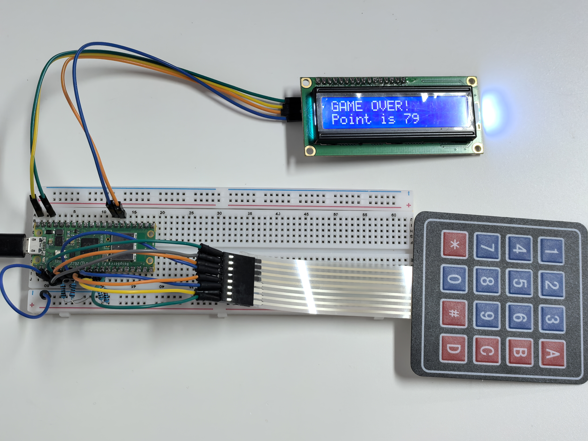

6.11 Game - Guess Number
=========================
Guessing Numbers is a fun party game where you and your friends input numbers (0-99). With each input of the number, the range will shrink until a player answers the riddle correctly. Then the player is defeated and punished.

As an example, if the lucky number is 51, which the players cannot see, and the player 1 inputs 50, the prompt changes to 50 - 99; if the player 2 inputs 70, the range changes to 50 - 70; if the player 3 inputs 51, the player is unlucky. In this case, numbers are inputted through the keypad, and outcomes are displayed on a LCD screen.

Component List
^^^^^^^^^^^^^^^
- Raspberry Pi Pico W x1
- MicroUSB cable x1
- 830 Tie-Points Breadboard x1
- Resistor 10KΩ x4
- 4x4 Keypad x1
- I2C LCD1602 x1
- Jumper Wire Several

Schematic
^^^^^^^^^^

This circuit is based on 3.2 4x4 Keypad with the addition of an I2C LCD1602 to display the pressed keys.

Connect
^^^^^^^^^

To make the wiring easier, in the above diagram, the column row of the matrix keyboard and the 10K resistors are inserted into the holes where G10 ~ G13 are located at the same time.

Code
^^^^^^^
.. note::

    * Open the ``6.11_game_guess_number.py`` file under the path of ``Ultimate-Starter-Kit-for-Pico\Python\1.Project`` or copy this code into Thonny, then click "Run Current Script" or simply press F5 to run it.

    * Don't forget to click on the "MicroPython (Raspberry Pi Pico)" interpreter in the bottom right corner. 

After the code runs, press A to start the game. A random number point is produced but not displayed on the LCD, and what you need to do is to guess it.

The number you have typed appears at the end of the first line till the final calculation is finished. (Press D to start the comparation.)

The number range of point is displayed on the second line. And you must type the number within the range.

When you type a number, the range narrows; if you got the lucky number luckily or unluckily, there will appear GAME OVER!.

The following is the program code:

.. code-block:: python

    from lcd1602 import LCD
    from machine import I2C, Pin
    import time
    import urandom

    # Initialize I2C communication for the LCD1602 display
    i2c = I2C(0, sda=Pin(20), scl=Pin(21), freq=400000)

    # Create an LCD object for controlling the LCD1602 display
    lcd = LCD(i2c)

    # Keypad character mapping for a 4x4 matrix keypad
    characters = [["1", "2", "3", "A"],
                ["4", "5", "6", "B"],
                ["7", "8", "9", "C"],
                ["*", "0", "#", "D"]]

    # Define row pins for the keypad
    pin = [2, 3, 4, 5]
    row = []
    for i in range(4):
        row.append(None)
        row[i] = machine.Pin(pin[i], machine.Pin.OUT)  # Set row pins as output

    # Define column pins for the keypad
    pin = [6, 7, 8, 9]
    col = []
    for i in range(4):
        col.append(None)
        col[i] = machine.Pin(pin[i], machine.Pin.IN)  # Set column pins as input

    # Function to read a key from the keypad
    def readKey():
        key = []
        for i in range(4):
            row[i].high()  # Set the row pin high
            for j in range(4):
                if col[j].value() == 1:  # Check if any column is pressed
                    key.append(characters[i][j])  # Record the corresponding key
            row[i].low()  # Set the row pin low
        if key == []:
            return None  # Return None if no key is pressed
        else:
            return key  # Return the pressed key

    # Initialize and reset the game variables (random pointValue, upper/lower limits)
    def init_new_value():
        global pointValue, upper, count, lower
        pointValue = int(urandom.uniform(0, 99))  # Generate a random number between 0 and 99
        print(pointValue)  # Print the target number (for debugging)
        upper = 99  # Set initial upper bound
        lower = 0  # Set initial lower bound
        count = 0  # Reset the player's guess count
        return False  # Indicate that the game has not ended

    # Function to display the game information on the LCD
    # If the player has guessed correctly, show "GAME OVER"
    # Otherwise, show the current guess and range
    def lcd_show(result):
        lcd.clear()  # Clear the LCD display
        if result == True:  # If the player guessed correctly
            string = "GAME OVER!\n"
            string += "Point is " + str(pointValue)  # Display the correct number
        else:
            string = "Enter number: " + str(count) + "\n"  # Show the player's current guess
            string += str(lower) + " < Point < " + str(upper)  # Show the range of possible values
        lcd.message(string)  # Send the string to the LCD
        return

    # Process the player's guess and update the upper or lower bound
    # If the guess matches the pointValue, return True to indicate the game is over
    # Otherwise, update the bounds and return False
    def number_processing():
        global upper, count, lower
        if count > pointValue:
            if count < upper:
                upper = count  # Update the upper bound if the guess is too high
        elif count < pointValue:
            if count > lower:
                lower = count  # Update the lower bound if the guess is too low
        elif count == pointValue:
            return True  # Return True if the guess matches the pointValue
        count = 0  # Reset the guess count for the next attempt
        return False

    ## Main game setup and loop
    # Display a welcome message and prompt the user to press 'A' to start
    string = "Press A to Start!"
    lcd.message(string)
    result = init_new_value()  # Initialize game variables

    # Main loop to handle keypad input and update the display
    last_key = None
    while True:
        current_key = readKey()  # Read the current key pressed
        if current_key == last_key:
            continue  # Skip processing if the same key is still pressed
        last_key = current_key  # Update the last pressed key

        if current_key != None:
            # If 'A' is pressed, restart the game with a new target number
            if current_key == ["A"]:
                result = init_new_value()
            # If 'D' is pressed, check if the current guess is correct
            elif current_key == ["D"]:
                result = number_processing()
            # If a number is pressed and the count is less than 10 digits
            elif current_key[0] in list("1234567890") and count < 10:
                count = count * 10 + int(current_key[0])  # Add the digit to the current guess
            lcd_show(result)  # Update the LCD with the current game state
        time.sleep(0.1)  # Small delay for key debounce

Phenomenon
^^^^^^^^^^^
