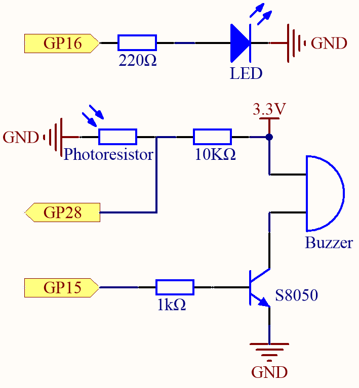
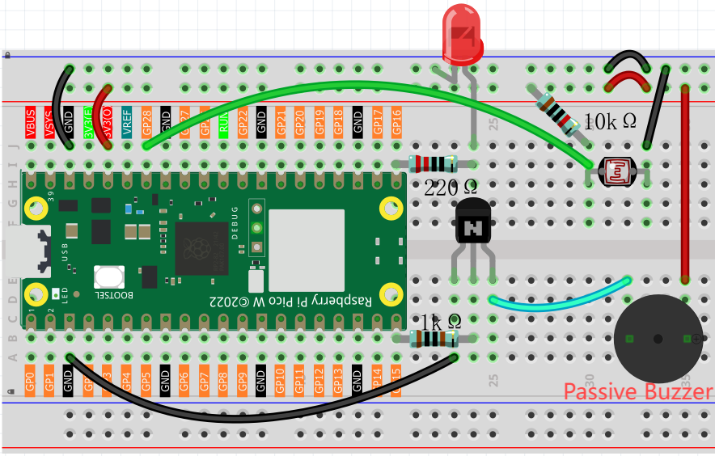
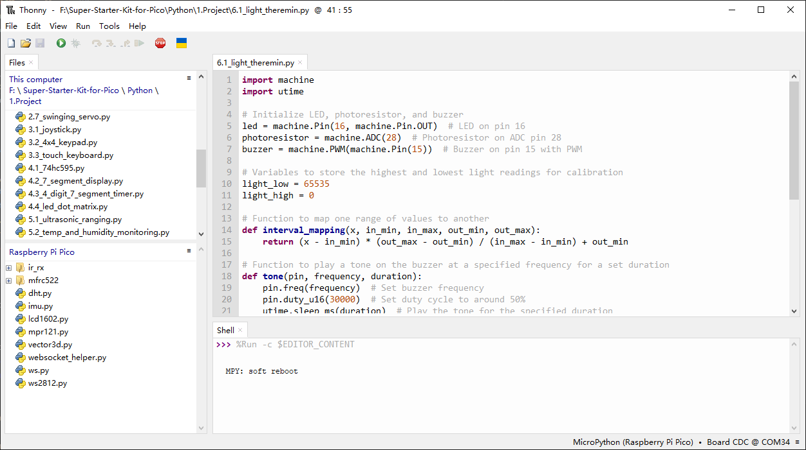

6.1 Light Theremin
=========================
Theremin is an electronic musical instrument that does not require physical contact. Based on the position of the player’s hand, it produces different tones.

Its controlling section is usually made up of two metal antennas that sense the position of the thereminist’s hands and control oscillators with one hand and volume with the other. The electric signals from the theremin are amplified and sent to a loudspeaker.

We cannot reproduce the same instrument through Pico W, but we can use photoresistor and passive buzzer to achieve similar gameplay.

Component List
^^^^^^^^^^^^^^^
- Raspberry Pi Pico W x1
- MicroUSB cable x1
- 830 Tie-Points Breadboard x1
- LED x1
- Transistor S8050 x1
- Resistor 220Ω, 1kΩ, 10kΩ x1
- Passive Buzzer x1
- Photoresistor x1
- Jumper Wire Several

Schematic
^^^^^^^^^^

Before starting the project, wave your hand up and down over the photoresistor to calibrate the range of light intensity. The LED connected in GP16 is used to indicate the debugging time, and the LED is lit to indicate the start of debugging and off to indicate the end of debugging.

When GP15 outputs high level, S8050 (NPN transistor) conducts and the passive buzzer starts to sound.

When the light is stronger, GP28’s value is smaller; vice versa, it is larger when the light is weaker. By programming the value of the photoresistor to affect the frequency of the passive buzzer, a photosensitive device can be simulated.

Connect
^^^^^^^^^

Code
^^^^^^^
.. note::

    * Open the ``6.1_light_theremin.py`` file under the path of ``Ultimate-Starter-Kit-for-Pico\Python\1.Project`` or copy this code into Thonny, then click "Run Current Script" or simply press F5 to run it.

    * Don't forget to click on the "MicroPython (Raspberry Pi Pico)" interpreter in the bottom right corner. 

Click “Run current script”, the LED will light up, and we will have five seconds to calibrate the photoresistor’s detection range.

This is due to the different light environments we may have when we use it (e.g., different light intensities at noon and dusk), as well as our hands’ height above the photoresistor. You need to set the maximum and minimum height of your hand from the photoresistor, which is also the height at which you play the instrument.

After five seconds, the LED will turn off, at which point we can wave our hands over the photoresistor and play.

The following is the program code:

.. code-block:: python

    import machine
    import utime

    # Initialize LED, photoresistor, and buzzer
    led = machine.Pin(16, machine.Pin.OUT)  # LED on pin 16
    photoresistor = machine.ADC(28)  # Photoresistor on ADC pin 28
    buzzer = machine.PWM(machine.Pin(15))  # Buzzer on pin 15 with PWM

    # Variables to store the highest and lowest light readings for calibration
    light_low = 65535
    light_high = 0

    # Function to map one range of values to another
    def interval_mapping(x, in_min, in_max, out_min, out_max):
        return (x - in_min) * (out_max - out_min) / (in_max - in_min) + out_min

    # Function to play a tone on the buzzer at a specified frequency for a set duration
    def tone(pin, frequency, duration):
        pin.freq(frequency)  # Set buzzer frequency
        pin.duty_u16(30000)  # Set duty cycle to around 50%
        utime.sleep_ms(duration)  # Play the tone for the specified duration
        pin.duty_u16(0)  # Turn off the tone by setting duty cycle to 0

    # Calibrate the photoresistor by finding the highest and lowest light values over 5 seconds
    timer_init_start = utime.ticks_ms()  # Get the current time (start time)
    led.value(1)  # Turn on LED to indicate calibration is in progress
    while utime.ticks_diff(utime.ticks_ms(), timer_init_start) < 5000:  # Run calibration for 5 seconds
        light_value = photoresistor.read_u16()  # Read the light value from the photoresistor
        if light_value > light_high:  # Track the maximum light value
            light_high = light_value
        if light_value < light_low:  # Track the minimum light value
            light_low = light_value
    led.value(0)  # Turn off the LED after calibration

    # Main loop to read light levels and play corresponding tones
    while True:
        light_value = photoresistor.read_u16()  # Read the current light value from the photoresistor
        pitch = int(interval_mapping(light_value, light_low, light_high, 50, 6000))  # Map light value to a pitch range
        if pitch > 50:  # Only play tones if the pitch is above a minimum threshold
            tone(buzzer, pitch, 20)  # Play the corresponding pitch for 20ms
        utime.sleep_ms(10)  # Small delay between readings

Phenomenon
^^^^^^^^^^^
.. video:: img/5.phenomenon/6.1.mp4
    :width: 100%