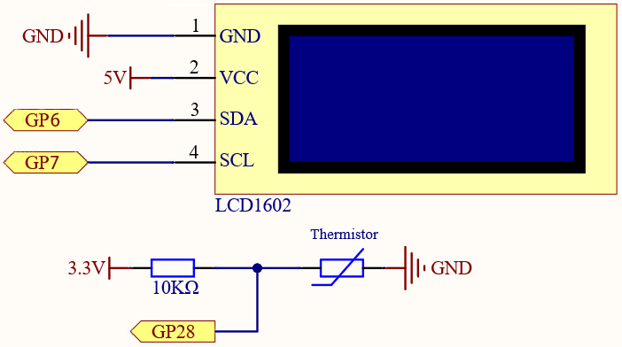
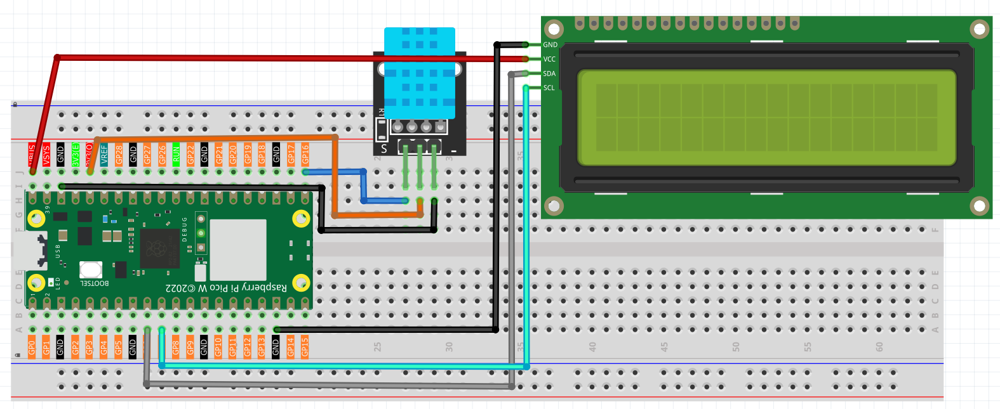
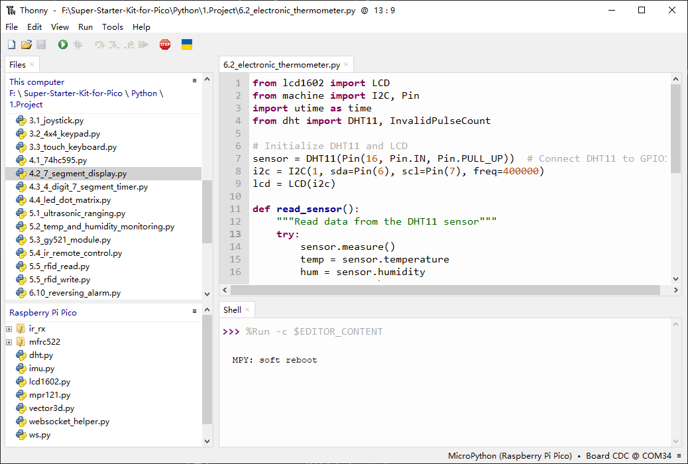

6.2 Electronic thermometer
==============================
Using a thermistor and an I2C LCD1602, we can create a room temperature meter.

This project is very simple, it is based on 2.13 Thermometer with I2C LCD1602 to display the temperature.

Component List
^^^^^^^^^^^^^^^
- Raspberry Pi Pico W x1
- MicroUSB cable x1
- 830 Tie-Points Breadboard x1
- LCD1602 IIC x1
- DHT11 Module x1
- Jumper Wire Several

Schematic
^^^^^^^^^^

.. image:: img/2.sch/6.2-1.png

Connect
^^^^^^^^^

Code
^^^^^^^
.. note::

    * Open the ``6.2_electronic_thermometer.py`` file under the path of ``Ultimate-Starter-Kit-for-Pico\1.Project`` or copy this code into Thonny, then click "Run Current Script" or simply press F5 to run it.

    * Don't forget to click on the "MicroPython (Raspberry Pi Pico)" interpreter in the bottom right corner. 

The LCD will display the temperature value in the current environment after the program runs.

The following is the program code:

.. code-block:: python

    from lcd1602 import LCD
    from machine import I2C, Pin
    import utime as time
    from dht import DHT11, InvalidPulseCount

    # Initialize DHT11 and LCD
    sensor = DHT11(Pin(16, Pin.IN, Pin.PULL_UP))  # Connect DHT11 to GPIO16
    i2c = I2C(1, sda=Pin(6), scl=Pin(7), freq=400000)
    lcd = LCD(i2c)

    def read_sensor():
        """Read data from the DHT11 sensor"""
        try:
            sensor.measure()
            temp = sensor.temperature
            hum = sensor.humidity
            return temp, hum
        except InvalidPulseCount:
            print('Invalid pulse count - retrying...')
            return None, None
        except Exception as e:
            print('Error reading sensor:', e)
            return None, None

    # Main loop
    while True:
        temp, hum = read_sensor()
        if temp is not None and hum is not None:
            # Display temperature and humidity
            string = "Temp: {:.1f}C\nHumi: {:.1f}%".format(temp, hum)
            lcd.message(string)
        else:
            lcd.message("Sensor Error\nPlease wait...")

        time.sleep(2)  # DHT11 recommends a sampling interval of at least 2 seconds
        lcd.clear()

Phenomenon
^^^^^^^^^^^
.. video:: img/5.phenomenon/6.2.mp4
    :width: 100%