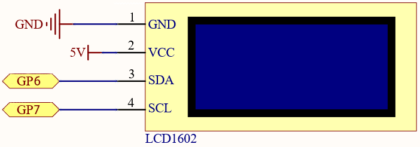

6.2 Electronic thermometer
=========================
Using a thermistor and an I2C LCD1602, we can create a room temperature meter.

This project is very simple, it is based on 2.13 Thermometer with I2C LCD1602 to display the temperature.

Component List
^^^^^^^^^^^^^^^
- Raspberry Pi Pico W x1
- MicroUSB cable x1
- 830 Tie-Points Breadboard x1
- LCD1602 IIC x1
- Thermistor x1
- Jumper Wire Several

Component knowledge
^^^^^^^^^^^^^^^^^^^^

:ref:`transistor <cpn_transistor>`
"""""""""""""""""""""""""""""""""""

:ref:`Buzzer <cpn_buzzer>`
"""""""""""""""""""""""""""

Schematic
^^^^^^^^^^

Connect
^^^^^^^^^

Code
^^^^^^^
.. note::

    * Open the ``6.2_electronic_thermometer.py`` file under the path of ``Super-Starter-Kit-for-Pico\Python\1.Project`` or copy this code into Thonny, then click "Run Current Script" or simply press F5 to run it.

    * Don't forget to click on the "MicroPython (Raspberry Pi Pico)" interpreter in the bottom right corner. 

The LCD will display the temperature value in the current environment after the program runs.

The following is the program code:

.. code-block:: python

    from lcd1602 import LCD
    from machine import I2C, Pin
    import utime
    import math

    # Initialize the thermistor (ADC on pin 28) and LCD display
    thermistor = machine.ADC(28)  # Analog input from the thermistor

    # Initialize I2C communication for the LCD1602 display
    i2c = I2C(1, sda=Pin(6), scl=Pin(7), freq=400000)

    # Create an LCD object for controlling the LCD1602 display
    lcd = LCD(i2c)

    # Main loop to continuously read temperature and display it
    while True:
        # Read raw ADC value from the thermistor
        temperature_value = thermistor.read_u16()

        # Convert the raw ADC value to a voltage (0-3.3V range)
        Vr = 3.3 * float(temperature_value) / 65535  # ADC value to voltage conversion

        # Calculate the thermistor resistance (using a voltage divider with a 10kOhm resistor)
        Rt = 10000 * Vr / (3.3 - Vr)  # Rt = thermistor resistance

        # Use the Steinhart-Hart equation to calculate the temperature in Kelvin
        # The values used are specific to the thermistor (3950 is the beta coefficient)
        temp = 1 / (((math.log(Rt / 10000)) / 3950) + (1 / (273.15 + 25)))  # Temperature in Kelvin

        # Convert temperature from Kelvin to Celsius
        Cel = temp - 273.15

        # Display the temperature on the LCD in Celsius
        string = " Temperature is \n    " + str('{:.2f}'.format(Cel)) + " C"  # Format string for the LCD
        lcd.message(string)  # Display the string on the LCD

        utime.sleep(1)  # Wait for 1 second
        lcd.clear()  # Clear the LCD for the next reading

Phenomenon
^^^^^^^^^^^
.. image:: img/5.phenomenon/6.2.mp4
    :width: 100%