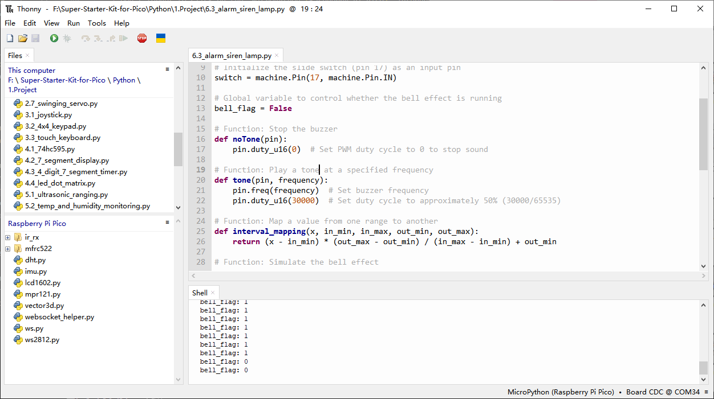

6.3 Alarm Siren Lamp
=========================
Police lights are often visible in real life (or in movies). Usually, it is used to maintain traffic, serve as a warning device, and serve as an important safety prop for officers, emergency vehicles, fire trucks, and engineering vehicles. When you see its lights or hear its sound, you must be careful, which means you (or those around you) may be in danger.

An LED and buzzer are used here to create a small warning light, which is activated by a slide switch.

Component List
^^^^^^^^^^^^^^^
- Raspberry Pi Pico W x1
- MicroUSB cable x1
- 830 Tie-Points Breadboard x1
- LED x1
- Transistor S8050 x1
- Resistor 220Ω, 1kΩ, 10kΩ x1
- Passive Buzzer x1
- Capacitor 104 x1
- Slide Switch x1
- Jumper Wire Several

Schematic
^^^^^^^^^^
.. image:: img/2.sch/6.3.png

GP17 is connected to the middle pin of the slider, along with a 10K resistor and a capacitor (filter) in parallel to GND, which allows the slider to output a steady high or low level when toggled to the left or right.

As soon as GP15 is high, the NPN transistor conducts, causing the passive buzzer to start sounding. This passive buzzer is programmed to gradually increase in frequency to produce a siren sound.

An LED is connected to GP16 and is programmed to periodically change its brightness in order to simulate a siren.

Connect
^^^^^^^^^

Code
^^^^^^^
.. note::

    * Open the ``6.3_alarm_siren_lamp.py`` file under the path of ``Ultimate-Starter-Kit-for-Pico\Python\1.Project`` or copy this code into Thonny, then click "Run Current Script" or simply press F5 to run it.

    * Don't forget to click on the "MicroPython (Raspberry Pi Pico)" interpreter in the bottom right corner. 

Click “Run current script”, toggle the slide switch to the left (yours may be to the right, depending on how your slide switch is wired) and the buzzer will emit a progressive warning tone and the LED will change its brightness accordingly; toggle the slide switch to the right and the buzzer and LED will stop working.

The following is the program code:

.. code-block:: python

    import machine
    import time

    # Initialize PWM for the buzzer (pin 15) and LED (pin 16)
    buzzer = machine.PWM(machine.Pin(15))  # PWM for buzzer
    led = machine.PWM(machine.Pin(16))  # PWM for LED
    led.freq(1000)  # Set LED PWM frequency to 1kHz

    # Initialize the slide switch (pin 17) as an input pin
    switch = machine.Pin(17, machine.Pin.IN)

    # Global variable to control whether the bell effect is running
    bell_flag = False

    # Function: Stop the buzzer
    def noTone(pin):
        pin.duty_u16(0)  # Set PWM duty cycle to 0 to stop sound

    # Function: Play a tone at a specified frequency
    def tone(pin, frequency):
        pin.freq(frequency)  # Set buzzer frequency
        pin.duty_u16(30000)  # Set duty cycle to approximately 50% (30000/65535)

    # Function: Map a value from one range to another
    def interval_mapping(x, in_min, in_max, out_min, out_max):
        return (x - in_min) * (out_max - out_min) / (in_max - in_min) + out_min

    # Function: Simulate the bell effect
    def bell_effect():
        while bell_flag:  # Continue running as long as bell_flag is True
            for i in range(0, 400, 2):  # Loop from 0 to 100 in steps of 2
                if not bell_flag:  # If bell_flag becomes False, exit immediately
                    break
                # Map i to LED brightness and buzzer frequency
                led.duty_u16(int(interval_mapping(i, 0, 100, 0, 65535)))  # LED brightness
                tone(buzzer, int(interval_mapping(i, 0, 100, 130, 800)))  # Buzzer frequency
                time.sleep_ms(10)  # Short delay for smooth transition
        # When bell_flag is False, turn off the buzzer and LED
        noTone(buzzer)
        led.duty_u16(0)

    # Interrupt handler: Toggle the bell_flag state
    def toggle(pin):
        global bell_flag
        bell_flag = pin.value()  # Set bell_flag based on the switch state
        print("bell_flag:", bell_flag)  # Print bell_flag state for debugging

    # Set up interrupt to detect both rising and falling edges of the switch
    switch.irq(trigger=machine.Pin.IRQ_RISING | machine.Pin.IRQ_FALLING, handler=toggle)

    # Main loop
    while True:
        if bell_flag:
            bell_effect()  # If bell_flag is True, start the bell effect
        else:
            noTone(buzzer)  # If bell_flag is False, stop the buzzer
            led.duty_u16(0)  # Turn off the LED  

Phenomenon
^^^^^^^^^^^
.. video:: img/5.phenomenon/6.3.mp4
    :width: 100%