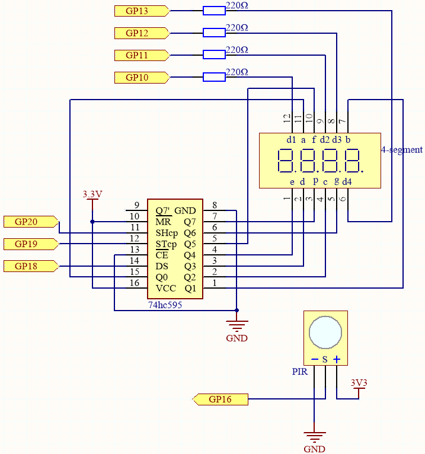
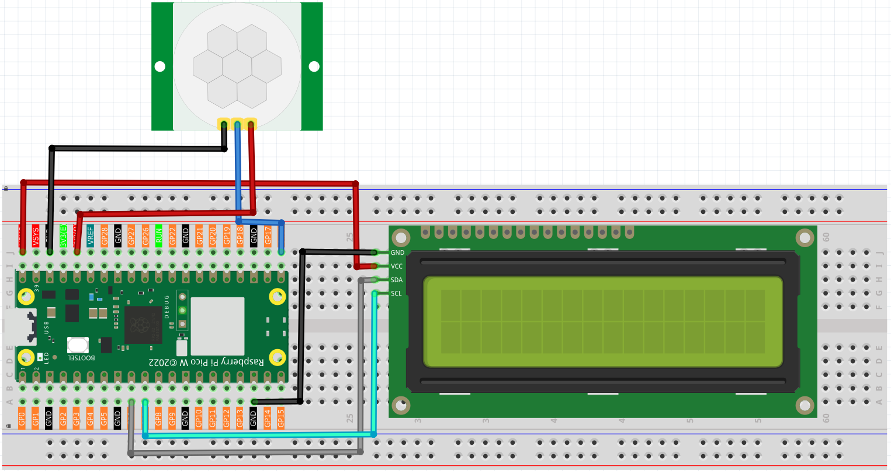
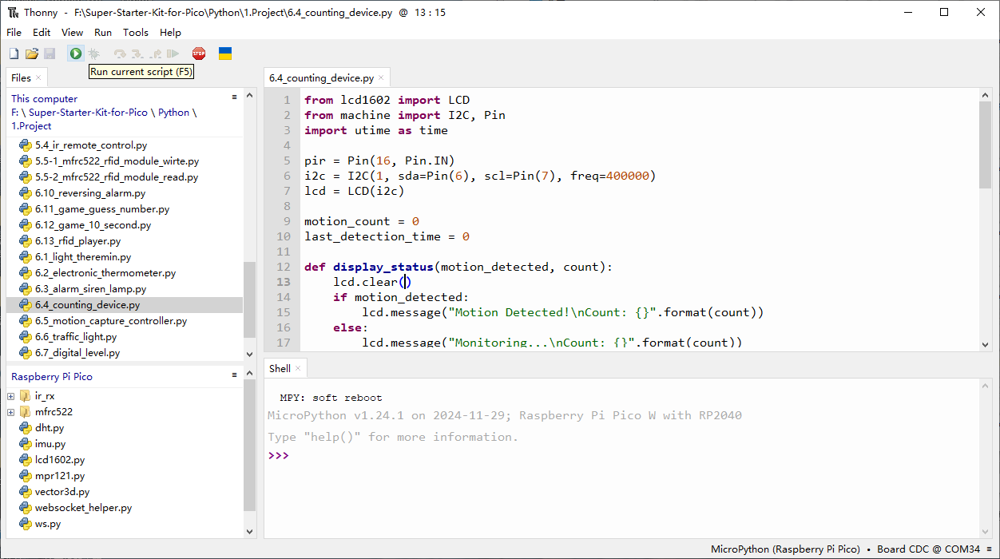

6.4 Counting Device
=========================
Here we will make a number-displaying counter system, consisting of a PIR sensor and a 4-digit segment display. When the PIR detects that someone is passing by, the number on the 4-digit segment display will add 1. You can use this counter to count the number of people walking through the passageway.

Component List
^^^^^^^^^^^^^^^
- Raspberry Pi Pico W x1
- MicroUSB cable x1
- 830 Tie-Points Breadboard x1
- Resistor 220Ω x4
- 4-Digit 7-Segment Display x1
- 74HC595 x1
- PIR Motion Sensor Module x1
- Jumper Wire Several

Component knowledge
^^^^^^^^^^^^^^^^^^^^

:ref:`transistor <cpn_transistor>`
"""""""""""""""""""""""""""""""""""

:ref:`Buzzer <cpn_buzzer>`
"""""""""""""""""""""""""""

Schematic
^^^^^^^^^^

This circuit is based on the 4.3 4 Digit 7 Segment Timer with the addition of a PIR module.

The PIR will send a high signal of about 2.8s long when someone passes by.

The PIR module has two potentiometers: one adjusts sensitivity, the other adjusts detection distance. To make the PIR module work better, you need to turn both of them counterclockwise to the end.

.. image:: img/6.other/PIR.png

Connect
^^^^^^^^^

.. note:: 
    * The PIR sensor will have a one-minute initialization time after powering on. During this period, infrared signals should be avoided, otherwise the measurement may be inaccurate.

    * There are two potentiometers on the PIR module: one is to adjust sensitivity and the other is to adjust the detection distance. To make the PIR module work better, you You need to turn both of them counterclockwise to the end.
Code
^^^^^^^
.. note::

    * Open the ``6.4_counting_device.py`` file under the path of ``Super-Starter-Kit-for-Pico\Python\1.Project`` or copy this code into Thonny, then click "Run Current Script" or simply press F5 to run it.

    * Don't forget to click on the "MicroPython (Raspberry Pi Pico)" interpreter in the bottom right corner. 

Click “Run current script”, the number on the 4-digit 7-segment display will be added by one if someone passes in front of the PIR module.

The following is the program code:

.. code-block:: python

    import machine
    import time

    # Initialize PIR sensor on pin 16, configured as an input
    pir_sensor = machine.Pin(16, machine.Pin.IN)

    # 7-segment display codes for digits 0-9, using hexadecimal to represent LED segments
    SEGCODE = [0x3f,0x06,0x5b,0x4f,0x66,0x6d,0x7d,0x07,0x7f,0x6f]

    # Define pins for shift register communication (74HC595)
    sdi = machine.Pin(18, machine.Pin.OUT)   # Serial Data Input
    rclk = machine.Pin(19, machine.Pin.OUT)  # Register Clock (Latch)
    srclk = machine.Pin(20, machine.Pin.OUT) # Shift Register Clock

    # Initialize list to store 4 digit control pins
    placePin = []

    # Define control pins for each of the four digits (common anodes)
    pin = [10,13,12,11] # Pin numbers for the 4-digit display
    for i in range(4):
        placePin.append(None)  # Reserve space in list
        placePin[i] = machine.Pin(pin[i], machine.Pin.OUT)  # Initialize pin as output

    # Initialize counter to keep track of detected motion events
    count = 0

    # Function to select which digit (0-3) to display by controlling the common anode pins
    def pickDigit(digit):
        for i in range(4):
            placePin[i].value(1)  # Turn off all digits
        placePin[digit].value(0)  # Turn on the selected digit

    # Function to clear the display by sending '0x00' to the shift register
    def clearDisplay():
        hc595_shift(0x00)

    # Function to send data to the shift register (74HC595)
    def hc595_shift(dat):
        rclk.low()  # Pull latch low to prepare for data shifting
        time.sleep_us(200)  # Small delay for timing stability
        for bit in range(7, -1, -1):  # Loop through each bit (MSB first)
            srclk.low()  # Prepare to send the next bit
            time.sleep_us(200)
            value = 1 & (dat >> bit)  # Extract the current bit from the data
            sdi.value(value)  # Set the data line to the current bit value
            time.sleep_us(200)
            srclk.high()  # Pulse the shift clock to store the bit in the register
            time.sleep_us(200)
        time.sleep_us(200)
        rclk.high()  # Pulse the register clock to move the data to the output

    # Interrupt handler for PIR sensor, triggered on motion detection (rising edge)
    # Increments the motion count each time the sensor is triggered
    def motion_detected(pin):
        global count
        count = count + 1  # Increment the count when motion is detected

    # Set up an interrupt to detect motion using the PIR sensor
    pir_sensor.irq(trigger=machine.Pin.IRQ_RISING, handler=motion_detected)

    # Main loop to continuously update the 7-segment display with the current count
    while True:
        # Update the first digit (units place)
        pickDigit(0)
        hc595_shift(SEGCODE[count % 10])

        # Update the second digit (tens place)
        pickDigit(1)
        hc595_shift(SEGCODE[count % 100 // 10])

        # Update the third digit (hundreds place)
        pickDigit(2)
        hc595_shift(SEGCODE[count % 1000 // 100])

        # Update the fourth digit (thousands place)
        pickDigit(3)
        hc595_shift(SEGCODE[count % 10000 // 1000])

Phenomenon
^^^^^^^^^^^
.. image:: img/5.phenomenon/x.mp4
    :width: 100%