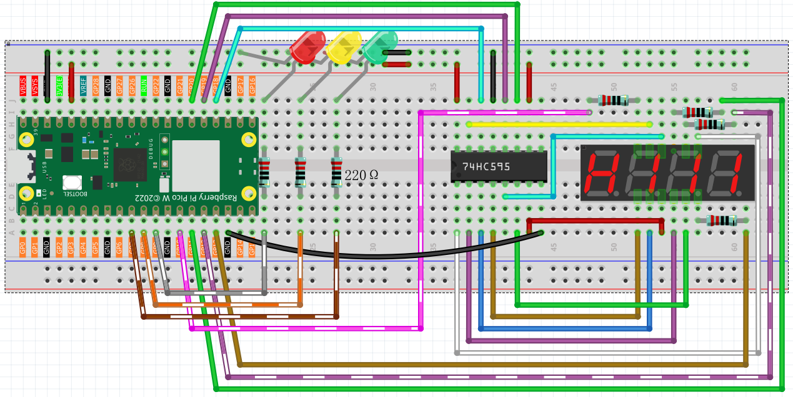

6.6 Traffic Light
=========================
Traffic Light is a signal device located at roadway intersections, crosswalks and other locations to control the flow of traffic.

Traffic signals are standardized by the Vienna Convention on Road Signs and Signals. Provides users with the right-of-way by alternating LEDs in three standard colors.

Red light: Traffic should stop if it sees a flashing red light, equivalent to a stop sign.

Yellow light: A warning signal is about to turn red. Yellow lights are interpreted differently in different countries (regions).

Green light: Allows traffic to move in the indicated direction.

In this project, we will use three colors of LEDs to implement traffic light changes and a 4-digit 7-segment display to show the time of each traffic state.

Component List
^^^^^^^^^^^^^^^
- Raspberry Pi Pico W x1
- MicroUSB cable x1
- 830 Tie-Points Breadboard x1
- Resistor 220Ω x7
- 4-Digit 7-Segment Display x1
- 74HC595 x1
- LED x3
- Jumper Wire Several

Schematic
^^^^^^^^^^

This circuit is based on the 4.3 Time Counter with the addition of 3 LEDs.

The 3 red, yellow and green LEDs are connected to GP7~GP9 respectively.

Connect
^^^^^^^^^

Code
^^^^^^^
.. note::

    * Open the ``6.6_traffic_light.py`` file under the path of ``Ultimate-Starter-Kit-for-Pico\Python\1.Project`` or copy this code into Thonny, then click "Run Current Script" or simply press F5 to run it.

    * Don't forget to click on the "MicroPython (Raspberry Pi Pico)" interpreter in the bottom right corner. 

Click “Run current script”, the green LED stays on for 30 seconds, the yellow LED stays on for 5 seconds, and the green LED stays on for 30 seconds.

The following is the program code:

.. code-block:: python

    import machine
    import time
    from machine import Timer

    # Define the duration for each traffic light color in seconds [Green, Yellow, Red]
    lightTime = [30, 5, 30]

    # 7-segment display codes for digits 0-9, using hexadecimal to represent LED segments
    SEGCODE = [0x3f, 0x06, 0x5b, 0x4f, 0x66, 0x6d, 0x7d, 0x07, 0x7f, 0x6f]

    # Initialize pins for shift register communication (74HC595)
    sdi = machine.Pin(18, machine.Pin.OUT)   # Serial Data Input
    rclk = machine.Pin(19, machine.Pin.OUT)  # Register Clock (Latch)
    srclk = machine.Pin(20, machine.Pin.OUT) # Shift Register Clock

    # Initialize list to store 4 digit control pins for the 7-segment display
    placePin = []
    pin = [10, 13, 12, 11]  # Pin numbers for the 4-digit display
    for i in range(4):
        placePin.append(None)  # Reserve space in list
        placePin[i] = machine.Pin(pin[i], machine.Pin.OUT)  # Initialize pins as output

    # Function to select which digit (0-3) to display by controlling the common anode pins
    def pickDigit(digit):
        for i in range(4):
            placePin[i].value(1)  # Turn off all digits
        placePin[digit].value(0)  # Turn on the selected digit

    # Function to clear the display by sending '0x00' to the shift register
    def clearDisplay():
        hc595_shift(0x00)

    # Function to send data to the shift register (74HC595)
    def hc595_shift(dat):
        rclk.low()  # Pull latch low to prepare for data shifting
        time.sleep_us(200)  # Small delay for timing stability
        for bit in range(7, -1, -1):  # Loop through each bit (MSB first)
            srclk.low()  # Prepare to send the next bit
            time.sleep_us(200)
            value = 1 & (dat >> bit)  # Extract the current bit from the data
            sdi.value(value)  # Set the data line to the current bit value
            time.sleep_us(200)
            srclk.high()  # Pulse the shift clock to store the bit in the register
            time.sleep_us(200)
        time.sleep_us(200)
        rclk.high()  # Pulse the register clock to move the data to the output

    # Function to display a number on the 7-segment display
    # This function breaks down the number into its individual digits and displays them
    def display(num):
        pickDigit(0)  # Select the units place
        hc595_shift(SEGCODE[num % 10])  # Display units

        pickDigit(1)  # Select the tens place
        hc595_shift(SEGCODE[num % 100 // 10])  # Display tens

        pickDigit(2)  # Select the hundreds place
        hc595_shift(SEGCODE[num % 1000 // 100])  # Display hundreds

        pickDigit(3)  # Select the thousands place
        hc595_shift(SEGCODE[num % 10000 // 1000])  # Display thousands

    # Setup for traffic light LEDs (Red, Yellow, Green)
    # LEDs are connected to pins 9 (Green), 8 (Yellow), and 7 (Red)
    pin = [7, 8, 9]  # LED pin numbers
    led = []
    for i in range(3):
        led.append(None)  # Reserve space in list
        led[i] = machine.Pin(pin[i], machine.Pin.OUT)  # Initialize each pin as output for LEDs

    # Function to turn on the correct LED based on the current state
    # 0 = Green, 1 = Yellow, 2 = Red
    def lightup(state):
        for i in range(3):
            led[i].value(0)  # Turn off all LEDs
        led[state].value(1)  # Turn on the selected LED (Green, Yellow, or Red)

    # Timer-related variables
    counter = 0  # Counter for the remaining time
    color_state = 0  # Current state of the traffic light (0 = Green, 1 = Yellow, 2 = Red)

    # Timer interrupt callback to update the traffic light state and counter
    def time_count(ev):
        global counter, color_state
        counter -= 1  # Decrease the counter by 1 second
        if counter <= 0:  # If the counter reaches zero, switch to the next light color
            color_state = (color_state + 1) % 3  # Cycle through Green, Yellow, and Red
            counter = lightTime[color_state]  # Reset counter based on the new color's duration

    # Initialize a timer to call the time_count function every 1 second (1000ms)
    tim = Timer(period=1000, mode=Timer.PERIODIC, callback=time_count)

    # Main loop to update the 7-segment display and traffic light LEDs
    while True:
        display(counter)  # Update the display with the remaining time
        lightup(color_state)  # Update the traffic light LEDs based on the current color

Phenomenon
^^^^^^^^^^^
.. video:: img/5.phenomenon/6.6.mp4
    :width: 100%