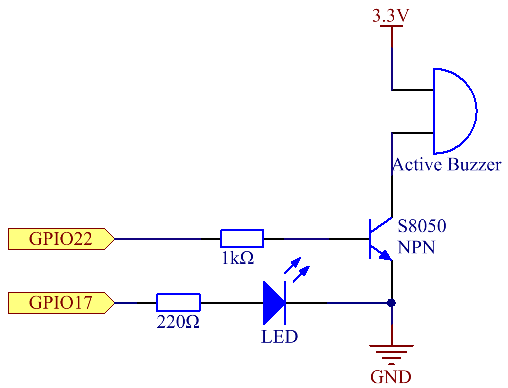
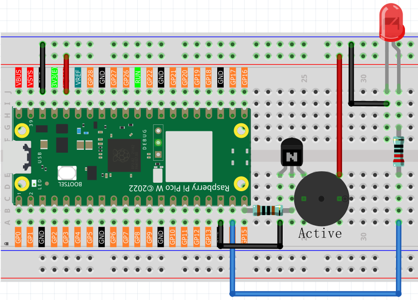
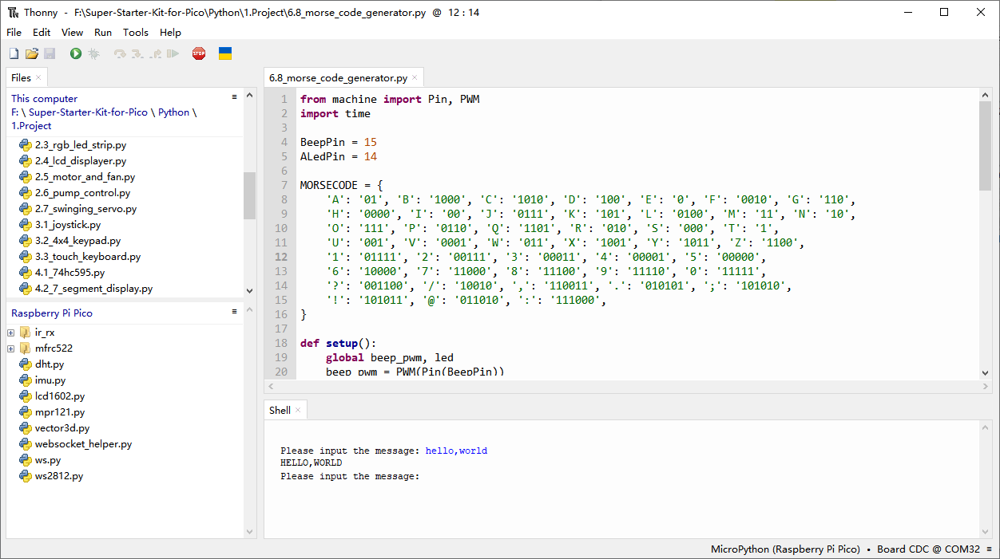

6.8 Morse Code Generator
=========================
In this course, we will make a manual alarm device. You can replace the toggle switch with a thermistor or a photosensitive sensor to make a temperature alarm or a light alarm.

Component List
^^^^^^^^^^^^^^^
- Raspberry Pi Pico W x1
- MicroUSB cable x1
- 830 Tie-Points Breadboard x1
- Transistor S8050 x1
- LED x1
- Resistor 220Ω x2 ,1kΩ x1
- Active Buzzer x1
- Jumper Wire Several

Schematic
^^^^^^^^^^

Connect
^^^^^^^^^

Code
^^^^^^^
.. note::

    * Open the ``6.8_morse_code_generator.py`` file under the path of ``Ultimate-Starter-Kit-for-Pico\Python\1.Project`` or copy this code into Thonny, then click "Run Current Script" or simply press F5 to run it.

    * Don't forget to click on the "MicroPython (Raspberry Pi Pico)" interpreter in the bottom right corner. 

Click “Run current script”, type a series of characters, and the buzzer and the LED will send the corresponding Morse code signals.

The following is the program code:
(需要修改为MicroPython的版本)

.. code-block:: python

    import RPi.GPIO as GPIO
    import time

    BeepPin=22
    ALedPin=17

    MORSECODE = {
        'A':'01', 'B':'1000', 'C':'1010', 'D':'100', 'E':'0', 'F':'0010', 'G':'110',
        'H':'0000', 'I':'00', 'J':'0111', 'K':'101', 'L':'0100', 'M':'11', 'N':'10',
        'O':'111', 'P':'0110', 'Q':'1101', 'R':'010', 'S':'000', 'T':'1',
        'U':'001', 'V':'0001', 'W':'011', 'X':'1001', 'Y':'1011', 'Z':'1100',
        '1':'01111', '2':'00111', '3':'00011', '4':'00001', '5':'00000',
        '6':'10000', '7':'11000', '8':'11100', '9':'11110', '0':'11111',
        '?':'001100', '/':'10010', ',':'110011', '.':'010101', ';':'101010',
        '!':'101011', '@':'011010', ':':'111000',
        }

    def setup():
        GPIO.setmode(GPIO.BCM)
        GPIO.setup(BeepPin, GPIO.OUT, initial=GPIO.LOW)
        GPIO.setup(ALedPin,GPIO.OUT,initial=GPIO.LOW)

    def on():
        GPIO.output(BeepPin, 1)
        GPIO.output(ALedPin, 1)

    def off():
        GPIO.output(BeepPin, 0)
        GPIO.output(ALedPin, 0)

    def beep(dt):	# dt for delay time.
        on()
        time.sleep(dt)
        off()
        time.sleep(dt)

    def morsecode(code):
        pause = 0.25
        for letter in code:
            for tap in MORSECODE[letter]:
                if tap == '0':
                    beep(pause/2)
                if tap == '1':
                    beep(pause)
            time.sleep(pause)

    def main():
        while True:
            code=input("Please input the messenger:")
            code = code.upper()
            print(code)
            morsecode(code)

    def destroy():
        print("")
        GPIO.output(BeepPin, GPIO.LOW)
        GPIO.output(ALedPin, GPIO.LOW)
        GPIO.cleanup()  

    if __name__ == '__main__':
        setup()
        try:
            main()
        except KeyboardInterrupt:
            destroy()

Phenomenon
^^^^^^^^^^^
.. video:: img/5.phenomenon/6.8.mp4
    :width: 100%