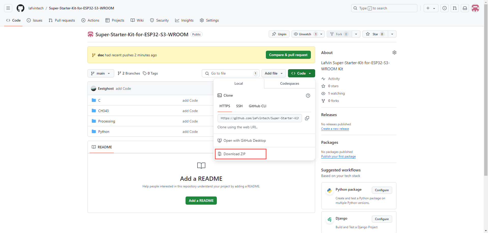
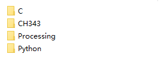

Download Code
==============
You can visit our repository to download the code for our course this time.

`Code Repository <https://github.com/lafvintech/Super-Starter-Kit-for-ESP32-S3-WROOM>`_

Alternatively, you can directly access this (link) in your browser, and it will automatically download the code as a ZIP file.

`Code Download <https://codeload.github.com/lafvintech/Super-Starter-Kit-for-ESP32-S3-WROOM/zip/refs/heads/main>`_

After downloading and extracting the ZIP file, you should have these four folders.

